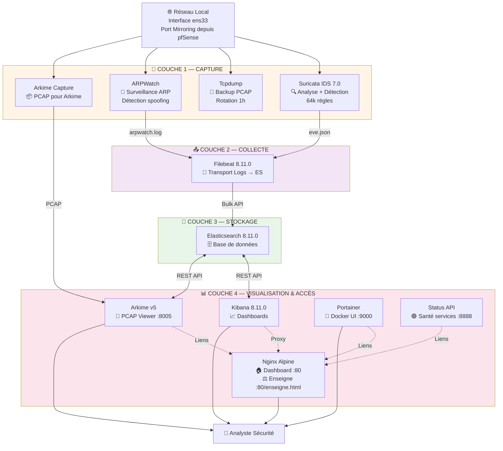
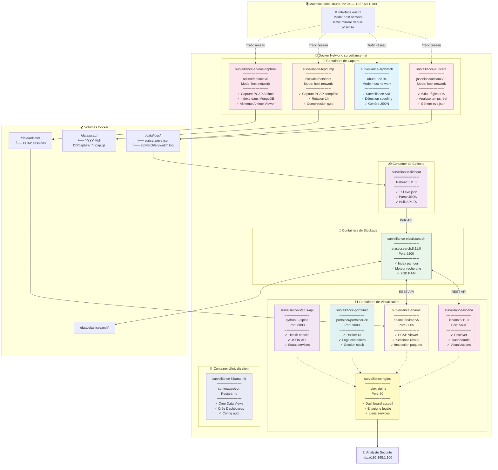
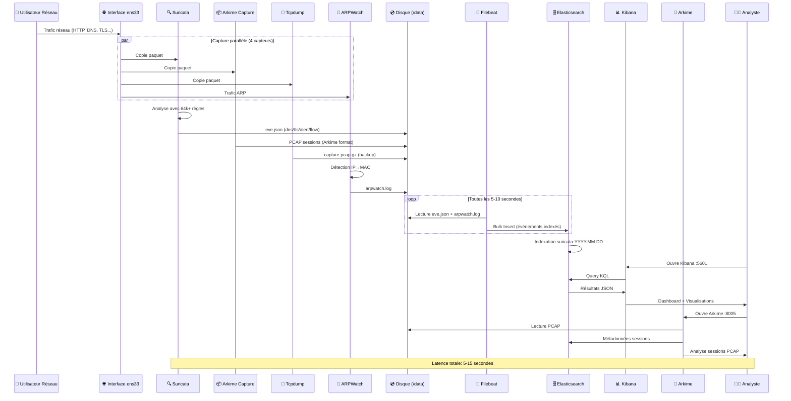

<div align="center">

# 🎓 École Supérieure Polytechnique de Dakar
## Université Cheikh Anta Diop (UCAD)

---

### Département de Génie Informatique
**Diplôme d'Ingénieur de Conception — DIC-3-GLSI**

---

# 🛡️ Projet NSOC
## Network Security Operations Center
### Plateforme de Surveillance Réseau en Temps Réel

---


---

### 👥 Groupe de Projet

**Membres :**
- **Salif Biaye**
- **Ndeye Astou Diagouraga**

---

**Année Académique :** 2025-2026
**Date :** Février 2026
**Version :** 3.0 — Stack 12 services

---

</div>

<div style="page-break-after: always;"></div>

---

# Architecture Finale — Plateforme de Surveillance Réseau

<div align="center">

**🛡️ Projet NSOC — Network Security Operations Center**

📍 **Institution :** École Supérieure Polytechnique (ESP) — UCAD
🎓 **Formation :** Département Génie Informatique — DIC-3-GLSI
👥 **Groupe :** Salif Biaye & Ndeye Astou Diagouraga
📅 **Date :** Février 2026 | **Version :** 3.0

</div>

---

## 📋 Table des Matières

1. [🔭 Vue d'Ensemble](#vue-densemble)
2. [📺 Démonstrations Vidéo](#démonstrations-vidéo)
3. [⚙️ Stack Technologique (12 services)](#stack-technologique)
4. [🏗️ Architecture](#architecture)
5. [🔄 Flux de Données](#flux-de-données)
6. [🧩 Composants Détaillés](#composants-détaillés)
7. [🔐 Authentification](#authentification)
8. [⚖️ Enseigne Légale](#enseigne-légale)
9. [💾 Stockage](#stockage)
10. [🚀 Utilisation](#utilisation)
11. [⚡ Performance](#performance)
12. [🔒 Sécurité](#sécurité)

---

## 🔭 Vue d'Ensemble

Système de surveillance réseau complet pour la capture, l'analyse, la détection et la visualisation du trafic réseau en temps réel. La plateforme intègre un IDS, un analyseur PCAP, une stack ELK et une enseigne légale de conformité.

### Objectifs

- ✅ Capture complète du trafic réseau (PCAP via Arkime v5)
- ✅ Détection d'intrusions en temps réel (Suricata 7.0 + 64k règles)
- ✅ Stockage et indexation des événements (Elasticsearch 8.11.0)
- ✅ Visualisation et dashboards interactifs (Kibana 8.11.0)
- ✅ Analyse PCAP avancée (Arkime v5 — port 8005)
- ✅ Enseigne légale de conformité (Nginx — `/enseigne.html`)
- ✅ API de statut des services (Python — port 8888)
- ✅ Gestion des containers (Portainer — port 9000)

### Page d'accueil du NSOC


> 💡 **INFO :** La page d'accueil Nginx (port 80) centralise les liens vers tous les services de la plateforme : Kibana, Arkime, Portainer, API Status et l'enseigne légale.

---

## 📺 Démonstrations Vidéo

<div align="center">

### 🎬 Présentation Complète de la Plateforme

</div>

| # | Vidéo | Description | Lien |
|---|-------|-------------|------|
| **V1** | Démarrage `docker compose up -d` | Stack qui démarre, 12 containers UP | [▶️ Regarder](https://drive.google.com/file/d/1C6cFiyPUT6xF9mQsXnIZZO_VtcaFRSdg/view?usp=sharing) |
| **V2** | Client → pfSense → enseigne NSOC | Client se connecte, voit l'enseigne | [▶️ Regarder](https://drive.google.com/file/d/1BFD2yxSL5Ewzo3hR0VlxVSrHhWvuiEWZ/view?usp=sharing) |
| **V3** | Kibana — 3 types d'events en temps réel | Navigation dns/tls/alert + filtrage KQL | [▶️ Regarder](https://drive.google.com/file/d/1edsoMSsD29oPZrCvWZfDR1OvNWIsvQlF/view?usp=drive_link) |
| **V4** | Arkime — analyse PCAP | Sessions, inspection paquet, filtres | [▶️ Regarder](https://drive.google.com/file/d/13lY-yqm7IhCPP3bwPHHnZUO79UXNN-o3/view?usp=drive_link) |
| **V5** | Alerte Suricata en direct | `curl testmyids.com` → alerte Kibana | [▶️ Regarder](https://drive.google.com/file/d/1nV1J8AEcqiTDTcOEsJcAxU81DvwLGSYR/view?usp=drive_link) |
| **V6** | Dashboard Kibana avec trafic client | Trafic client → logs en temps réel | [▶️ Regarder](https://drive.google.com/file/d/16mRnaiE0Jc_1Nl07DOWXne9ULi6ymKjW/view?usp=drive_link) |

> 💡 **INFO :** Recommandation — Regardez V1 et V3 en premier pour comprendre le démarrage et les événements Kibana.

---

<div style="page-break-after: always;"></div>

## ⚙️ Stack Technologique

### 12 Services Déployés

| # | Composant | Version | Rôle | Port |
|---|-----------|---------|------|------|
| 1 | **Suricata** | 7.0 | IDS/IPS — Détection de menaces + analyse | host |
| 2 | **Tcpdump** | Latest | Capture PCAP complète (backup) | host |
| 3 | **ARPWatch** | Latest | Surveillance paires IP/MAC | host |
| 4 | **Filebeat** | 8.11.0 | Collecte et transport des logs | interne |
| 5 | **Elasticsearch** | 8.11.0 | Stockage et indexation | 9200 |
| 6 | **Kibana** | 8.11.0 | Visualisation et dashboards | 5601 |
| 7 | **Arkime** | v5 | Analyse PCAP interactive | 8005 |
| 8 | **Arkime Capture** | v5 | Daemon de capture PCAP pour Arkime | interne |
| 9 | **Nginx** | Alpine | Page d'accueil + proxy + enseigne | 80 |
| 10 | **Portainer** | Latest | Gestion Docker (UI web) | 9000 |
| 11 | **Status API** | Python 3 | API santé des services | 8888 |
| 12 | **Kibana Init** | curl | Initialisation Data Views + Dashboards | — |

### Vue Portainer — Containers Actifs


> ✅ **SUCCÈS :** La stack complète est opérationnelle avec 12 services tous en état `UP`.

---

<div style="page-break-after: always;"></div>

## 🏗️ Architecture

### Diagramme d'Architecture


### Schéma Global — 4 Couches


```mermaid
flowchart TD
    Network[🌐 Réseau Local<br/>Interface ens33<br/>Port Mirroring depuis pfSense]

    subgraph Capture["📡 COUCHE 1 — CAPTURE"]
        Suricata[Suricata IDS 7.0<br/>🔍 Analyse + Détection<br/>64k règles]
        Tcpdump[Tcpdump<br/>💾 Backup PCAP<br/>Rotation 1h]
        ARPWatch[ARPWatch<br/>🔐 Surveillance ARP<br/>Détection spoofing]
        ArkimeCapture[Arkime Capture<br/>📦 PCAP pour Arkime]
    end

    subgraph Collecte["📤 COUCHE 2 — COLLECTE"]
        Filebeat[Filebeat 8.11.0<br/>📨 Transport Logs → ES]
    end

    subgraph Stockage["💾 COUCHE 3 — STOCKAGE"]
        Elasticsearch[Elasticsearch 8.11.0<br/>🗄️ Base de données]
    end

    subgraph Visualisation["📊 COUCHE 4 — VISUALISATION & ACCÈS"]
        Kibana[Kibana 8.11.0<br/>📈 Dashboards]
        Arkime[Arkime v5<br/>🦈 PCAP Viewer :8005]
        Nginx[Nginx Alpine<br/>🏠 Dashboard :80<br/>⚖️ Enseigne :80/enseigne.html]
        Portainer[Portainer<br/>🐳 Docker UI :9000]
        StatusAPI[Status API<br/>🟢 Santé services :8888]
    end

    Network --> Suricata
    Network --> Tcpdump
    Network --> ARPWatch
    Network --> ArkimeCapture

    Suricata -->|eve.json| Filebeat
    ARPWatch -->|arpwatch.log| Filebeat
    ArkimeCapture -->|PCAP| Arkime

    Filebeat -->|Bulk API| Elasticsearch

    Elasticsearch <-->|REST API| Kibana
    Elasticsearch <-->|REST API| Arkime

    Kibana -.->|Proxy| Nginx
    Arkime -.->|Liens| Nginx
    Portainer -.->|Liens| Nginx
    StatusAPI -.->|Liens| Nginx

    Nginx --> User[👤 Analyste Sécurité]
    Kibana --> User
    Arkime --> User
    Portainer --> User

    style Capture fill:#fff4e6
    style Collecte fill:#f3e5f5
    style Stockage fill:#e8f5e9
    style Visualisation fill:#fce4ec
```

### Architecture Détaillée — Containers Docker


```mermaid
graph TB
    subgraph Host["🖥️ Machine Hôte Ubuntu 22.04 — 192.168.1.100"]
        Interface[🌐 Interface ens33<br/>Mode: host network<br/>Trafic mirroré depuis pfSense]
    end

    subgraph DockerNetwork["🐳 Docker Network: surveillance-net"]

        subgraph CaptureContainers["📡 Containers de Capture"]
            SuricataC["surveillance-suricata<br/>━━━━━━━━━━━━<br/>jasonish/suricata:7.0<br/>Mode: host network<br/>━━━━━━━━━━━━<br/>✓ 64k+ règles IDS<br/>✓ Analyse temps réel<br/>✓ Génère eve.json"]

            TcpdumpC["surveillance-tcpdump<br/>━━━━━━━━━━━━<br/>nicolaka/netshoot<br/>Mode: host network<br/>━━━━━━━━━━━━<br/>✓ Capture PCAP complète<br/>✓ Rotation 1h<br/>✓ Compression gzip"]

            ARPWatchC["surveillance-arpwatch<br/>━━━━━━━━━━━━<br/>ubuntu:22.04<br/>Mode: host network<br/>━━━━━━━━━━━━<br/>✓ Surveillance ARP<br/>✓ Détection spoofing<br/>✓ Génère JSON"]

            ArkimeCaptureC["surveillance-arkime-capture<br/>━━━━━━━━━━━━<br/>arkime/arkime:v5<br/>Mode: host network<br/>━━━━━━━━━━━━<br/>✓ Capture PCAP Arkime<br/>✓ Indexe dans MongoDB<br/>✓ Alimente Arkime Viewer"]
        end

        subgraph CollecteContainer["📤 Container de Collecte"]
            FilebeatC["surveillance-filebeat<br/>━━━━━━━━━━━━<br/>filebeat:8.11.0<br/>━━━━━━━━━━━━<br/>✓ Tail eve.json<br/>✓ Parse JSON<br/>✓ Bulk API ES"]
        end

        subgraph StockageContainer["💾 Containers de Stockage"]
            ElasticsearchC["surveillance-elasticsearch<br/>━━━━━━━━━━━━<br/>elasticsearch:8.11.0<br/>Port: 9200<br/>━━━━━━━━━━━━<br/>✓ Index par jour<br/>✓ Moteur recherche<br/>✓ 2GB RAM"]
        end

        subgraph VisualisationContainers["📊 Containers de Visualisation"]
            KibanaC["surveillance-kibana<br/>━━━━━━━━━━━━<br/>kibana:8.11.0<br/>Port: 5601<br/>━━━━━━━━━━━━<br/>✓ Discover<br/>✓ Dashboards<br/>✓ Visualizations"]

            ArkimeC["surveillance-arkime<br/>━━━━━━━━━━━━<br/>arkime/arkime:v5<br/>Port: 8005<br/>━━━━━━━━━━━━<br/>✓ PCAP Viewer<br/>✓ Sessions réseau<br/>✓ Inspection paquets"]

            NginxC["surveillance-nginx<br/>━━━━━━━━━━━━<br/>nginx:alpine<br/>Port: 80<br/>━━━━━━━━━━━━<br/>✓ Dashboard accueil<br/>✓ Enseigne légale<br/>✓ Liens services"]

            PortainerC["surveillance-portainer<br/>━━━━━━━━━━━━<br/>portainer/portainer-ce<br/>Port: 9000<br/>━━━━━━━━━━━━<br/>✓ Docker UI<br/>✓ Logs containers<br/>✓ Gestion stack"]

            StatusC["surveillance-status-api<br/>━━━━━━━━━━━━<br/>python:3-alpine<br/>Port: 8888<br/>━━━━━━━━━━━━<br/>✓ Health checks<br/>✓ JSON API<br/>✓ Statut services"]
        end

        subgraph InitContainer["⚙️ Container d'Initialisation"]
            KibanaInitC["surveillance-kibana-init<br/>━━━━━━━━━━━━<br/>curlimages/curl<br/>Restart: no<br/>━━━━━━━━━━━━<br/>✓ Crée Data Views<br/>✓ Crée Dashboards<br/>✓ Config auto"]
        end
    end

    subgraph Volumes["💿 Volumes Docker"]
        DataLogs["/data/logs/<br/>├── suricata/eve.json<br/>└── arpwatch/arpwatch.log"]
        DataPCAP["/data/pcap/<br/>└── YYYY-MM-DD/capture_*.pcap.gz"]
        DataES["/data/elasticsearch/"]
        DataArkime["/data/arkime/<br/>└── PCAP sessions"]
    end

    Interface -.->|Trafic réseau| SuricataC
    Interface -.->|Trafic réseau| TcpdumpC
    Interface -.->|Trafic réseau| ARPWatchC
    Interface -.->|Trafic réseau| ArkimeCaptureC

    SuricataC --> DataLogs
    ARPWatchC --> DataLogs
    TcpdumpC --> DataPCAP
    ArkimeCaptureC --> DataArkime

    DataLogs --> FilebeatC
    FilebeatC -->|Bulk API| ElasticsearchC
    ElasticsearchC <--> DataES

    ElasticsearchC <-->|REST API| KibanaC
    ElasticsearchC <-->|REST API| ArkimeC
    DataArkime --> ArkimeC

    KibanaC -.-> NginxC
    ArkimeC -.-> NginxC
    PortainerC -.-> NginxC
    StatusC -.-> NginxC

    NginxC --> User[👤 Analyste Sécurité<br/>http://192.168.1.100]

    style SuricataC fill:#ffebee
    style TcpdumpC fill:#fff3e0
    style ARPWatchC fill:#e1f5fe
    style ArkimeCaptureC fill:#fce4ec
    style FilebeatC fill:#f3e5f5
    style ElasticsearchC fill:#e8f5e9
    style KibanaC fill:#fce4ec
    style ArkimeC fill:#fff8e1
    style NginxC fill:#fff9c4
    style PortainerC fill:#e0f2f1
    style StatusC fill:#f3e5f5
    style KibanaInitC fill:#e8eaf6
```

---

<div style="page-break-after: always;"></div>

## 🔄 Flux de Données

### Diagramme de Séquence — Flux Complet


```mermaid
sequenceDiagram
    participant User as 👤 Utilisateur Réseau
    participant Net as 🌐 Interface ens33
    participant Suri as 🔍 Suricata
    participant ArkC as 📦 Arkime Capture
    participant TCP as 💾 Tcpdump
    participant ARP as 🔐 ARPWatch
    participant Disk as 💿 Disque (/data)
    participant FB as 📨 Filebeat
    participant ES as 🗄️ Elasticsearch
    participant Kib as 📊 Kibana
    participant Ark as 🦈 Arkime
    participant Analyst as 👨‍💼 Analyste

    User->>Net: Trafic réseau (HTTP, DNS, TLS...)

    par Capture parallèle (4 capteurs)
        Net->>Suri: Copie paquet
        Net->>ArkC: Copie paquet
        Net->>TCP: Copie paquet
        Net->>ARP: Trafic ARP
    end

    Suri->>Suri: Analyse avec 64k+ règles
    Suri->>Disk: eve.json (dns/tls/alert/flow)

    ArkC->>Disk: PCAP sessions (Arkime format)

    TCP->>Disk: capture.pcap.gz (backup)

    ARP->>ARP: Détection IP↔MAC
    ARP->>Disk: arpwatch.log

    loop Toutes les 5-10 secondes
        FB->>Disk: Lecture eve.json + arpwatch.log
        FB->>ES: Bulk Insert (événements indexés)
    end

    ES->>ES: Indexation suricata-YYYY.MM.DD

    Analyst->>Kib: Ouvre Kibana :5601
    Kib->>ES: Query KQL
    ES->>Kib: Résultats JSON
    Kib->>Analyst: Dashboard + Visualisations

    Analyst->>Ark: Ouvre Arkime :8005
    Ark->>Disk: Lecture PCAP
    Ark->>ES: Métadonnées sessions
    Ark->>Analyst: Analyse sessions PCAP

    Note over Suri,Analyst: Latence totale: 5-15 secondes
```

### Flux résumé

```
📡 Réseau (ens33)
    │
    ├──→ Suricata ──→ eve.json ──→ Filebeat ──→ Elasticsearch ──→ Kibana
    │
    ├──→ Arkime Capture ──→ PCAP sessions ──→ Arkime Viewer :8005
    │
    ├──→ Tcpdump ──→ capture.pcap.gz (backup forensique)
    │
    └──→ ARPWatch ──→ arpwatch.log ──→ Filebeat ──→ Elasticsearch
```

---

<div style="page-break-after: always;"></div>

## 🧩 Composants Détaillés

### Suricata 7.0 — IDS/IPS

**Fonction :** Détection d'intrusions et analyse de trafic réseau

| Paramètre | Valeur |
|-----------|--------|
| Image | `jasonish/suricata:7.0` |
| Interface | `ens33` (mode host network) |
| Règles | Emerging Threats — 64 425 règles |
| Output | `/data/logs/suricata/eve.json` |

**Types d'événements capturés :**

```
event_type: "dns"    → Requêtes DNS (domaines interrogés)
event_type: "tls"    → Connexions HTTPS (SNI, certificats)
event_type: "alert"  → Alertes IDS (menaces détectées)
event_type: "http"   → Trafic HTTP (méthodes, URLs)
event_type: "flow"   → Métadonnées de flux réseau
```

**Kibana — Events Suricata : DNS** (`suricata-*` | `event_type: "dns"`)


**Kibana — Events Suricata : TLS** (`suricata-*` | `event_type: "tls"`)


**Kibana — Events Suricata : Alertes IDS** (`suricata-*` | `event_type: "alert"`)


**Commandes utiles :**
```bash
# Logs en temps réel
docker compose logs -f suricata

# Compter les événements
wc -l data/logs/suricata/eve.json

# Voir les alertes uniquement
tail -f data/logs/suricata/eve.json | jq 'select(.event_type=="alert")'
```

---

### Arkime v5 — Analyseur PCAP

> 💡 **INFO :** Arkime (anciennement Moloch) est la solution open source de référence pour l'analyse PCAP interactive. Il indexe les sessions réseau dans Elasticsearch et offre une interface de recherche avancée.

**Accès :** `http://192.168.1.100:8005`

| Paramètre | Valeur |
|-----------|--------|
| Image | `arkime/arkime:v5` |
| Port | `8005` |
| Credentials | `admin` / `admin` |
| Backend | Elasticsearch 9200 |

**Fonctionnalités :**
- 🔍 Recherche avancée dans les sessions PCAP
- 📦 Inspection des paquets (payload, headers)
- 📊 Statistiques par protocole, IP, port
- 🔗 Corrélation avec les alertes Suricata

**Vue Sessions Arkime :**


**Vue Détail Session :**


**Requêtes Arkime (exemples) :**
```
ip.src == 192.168.1.50            # Sessions par IP source
protocols == http                  # Sessions HTTP uniquement
port.dst == 443                    # Sessions HTTPS
ip.dst == 8.8.8.8 && port.dst==53 # Requêtes DNS vers Google
```

---

### Status API — Backend Python

> 💡 **INFO :** L'API de statut est un service Python léger qui vérifie en temps réel la santé de tous les services de la plateforme.

**Accès :** `http://192.168.1.100:8888`

| Paramètre | Valeur |
|-----------|--------|
| Image | `python:3-alpine` |
| Port | `8888` |
| Format | JSON |

**Vérification :**
```bash
# Statut de tous les services
curl http://192.168.1.100:8888/health | jq '.'

# Exemple de réponse
{
  "status": "ok",
  "services": {
    "elasticsearch": "up",
    "kibana": "up",
    "arkime": "up",
    "suricata": "up"
  }
}
```

---

### Enseigne Légale — Conformité

> ⚠️ **ATTENTION :** Conformément aux bonnes pratiques et à la législation, tout réseau surveillé doit afficher un avertissement visible. L'enseigne légale est accessible sur `/enseigne.html`.

**Accès :** `http://192.168.1.100/enseigne.html`

**Contenu de l'enseigne :**
```
⚠️ RÉSEAU SURVEILLÉ
Ce réseau fait l'objet d'une surveillance informatique
dans le cadre du projet académique NSOC (ESP-UCAD).
Toute connexion implique votre consentement à cette surveillance.
Aucune confidentialité n'est garantie.
```

**Vérification :**
```bash
# Test depuis Ubuntu NSOC
curl http://localhost/enseigne.html

# Test depuis le client
curl http://192.168.1.100/enseigne.html
```

---

### Kibana 8.11.0 — Visualisation

**Accès :** `http://192.168.1.100:5601`

| Paramètre | Valeur |
|-----------|--------|
| Image | `kibana:8.11.0` |
| Port | `5601` |
| Credentials | `elastic` / `changeme` |

**Dashboard personnalisé #1 :**


**Dashboard personnalisé #2 :**


**Les 3 sources d'events dans Kibana :**

> 💡 **INFO :** Kibana agrège les logs de **3 sources distinctes**, chacune dans son propre index Elasticsearch :
>
> | Index Kibana | Source | Types d'events |
> |-------------|--------|---------------|
> | `suricata-*` | Suricata IDS | dns, tls, alert, http, flow |
> | `arpwatch-*` | ARPWatch | new station, changed mac, flip-flop |
> | `pfsense-*` | pfSense Firewall | règles firewall, trafic bloqué, DHCP, NAT |

**Kibana — Events ARPWatch** (`arpwatch-*`)


**Kibana — Logs pfSense Firewall** (`pfsense-*`)


**Dashboard Kibana — Vue d'ensemble**


**Dashboard Kibana — Alertes IDS**


**Recherches KQL par index :**

*`suricata-*` — Events IDS :*
```kql
event_type: "dns"
event_type: "tls"
event_type: "alert"
src_ip: "192.168.1.50"
dns.rrname: *youtube*
alert.severity: 1
```

*`arpwatch-*` — Surveillance ARP :*
```kql
event_type: "new station"
event_type: "changed mac"
ip: "192.168.1.50"
```

*`pfsense-*` — Logs Firewall :*
```kql
action: "block"
src_ip: "192.168.1.50"
dest_port: 443
proto: "tcp"
```

---

### Nginx — Dashboard d'Accueil

**Accès :** `http://192.168.1.100`

**Liens disponibles depuis la page d'accueil :**

| Service | URL | Description |
|---------|-----|-------------|
| Kibana | `:5601` | Dashboards & Discover |
| Arkime | `:8005` | Analyse PCAP |
| Portainer | `:9000` | Gestion Docker |
| Status API | `:8888` | Santé services |
| Enseigne | `/enseigne.html` | Conformité légale |
| ES API | `:9200` | API Elasticsearch |

---

### Portainer — Gestion Docker

**Accès :** `http://192.168.1.100:9000`

| Paramètre | Valeur |
|-----------|--------|
| Port | `9000` |
| Credentials | Définir à la 1ère connexion |

**Fonctionnalités :**
- Vue liste de tous les containers avec statut
- Logs en temps réel par container
- Redémarrage / arrêt d'un service
- Inspection des volumes et réseaux

---

<div style="page-break-after: always;"></div>

## 🔐 Authentification

> ⚠️ **ATTENTION :** Ces credentials sont définis pour un usage en laboratoire. Changez-les avant tout déploiement en production.

| Service | URL | Identifiant | Mot de passe |
|---------|-----|-------------|--------------|
| **Kibana** | `:5601` | `elastic` | `changeme` |
| **Elasticsearch** | `:9200` | `elastic` | `changeme` |
| **Arkime** | `:8005` | `admin` | `admin` |
| **Portainer** | `:9000` | À définir | À définir |
| **Status API** | `:8888` | — | — (public) |

**Vérification Elasticsearch avec auth :**
```bash
curl -u elastic:changeme http://localhost:9200/_cluster/health?pretty
curl -u elastic:changeme http://localhost:9200/_cat/indices?v
```

---

## ⚖️ Enseigne Légale

> ⚠️ **ATTENTION — Obligation légale :** Ce système capture et analyse la totalité du trafic réseau traversant l'interface surveillée. L'affichage de l'enseigne légale est **obligatoire** avant toute mise en service.

**URL :** `http://192.168.1.100/enseigne.html`

**Vérification après démarrage :**
```bash
# Depuis la machine Ubuntu NSOC
curl -s http://localhost/enseigne.html | grep -i "surveillé"

# Depuis la machine cliente (confirmation)
curl -s http://192.168.1.100/enseigne.html
```

> ✅ **SUCCÈS :** L'enseigne doit être accessible et afficher l'avertissement de surveillance avant toute utilisation du réseau.

---

<div style="page-break-after: always;"></div>

## 💾 Stockage

### Organisation des Données

```
surveillance-reseau/
├── docker-compose.yml
├── .env
├── configs/
│   ├── suricata/suricata.yaml
│   ├── filebeat/filebeat.yml
│   ├── arkime/config.ini
│   └── nginx/
│       ├── nginx.conf
│       └── html/
│           ├── index.html          ← Dashboard d'accueil
│           └── enseigne.html       ← Page légale
├── data/
│   ├── elasticsearch/              ← Base de données ES
│   ├── logs/
│   │   ├── suricata/eve.json       ← Événements IDS
│   │   └── arpwatch/arpwatch.log   ← Événements ARP
│   ├── pcap/
│   │   └── YYYY-MM-DD/             ← PCAP Tcpdump
│   │       └── capture_*.pcap.gz
│   └── arkime/                     ← PCAP sessions Arkime
└── docs/
```

### Taille des Données

**Estimation journalière (réseau actif) :**

| Source | Taille/jour |
|--------|------------|
| PCAP Tcpdump | ~2 GB |
| PCAP Arkime | ~1 GB |
| Logs Suricata | ~100 MB |
| Elasticsearch | ~20 MB |
| **Total** | **~3.1 GB/jour** |

**Rétention recommandée :**

| Données | Rétention | Espace total |
|---------|-----------|-------------|
| PCAP | 7 jours | ~21 GB |
| Logs | 30 jours | ~3 GB |
| Elasticsearch | 30 jours | ~600 MB |

---

<div style="page-break-after: always;"></div>

## 🚀 Utilisation

### Démarrage de la Stack

```bash
# Depuis la machine Ubuntu NSOC
cd ~/surveillance-reseau/surveillance-reseau

# Démarrer les 12 services
docker compose up -d

# Vérifier l'état
docker compose ps

# Attendre 2-3 minutes pour l'initialisation complète
```

> 💡 **INFO :** L'initialisation d'Elasticsearch + Kibana prend 2-3 minutes. Patientez avant d'accéder aux interfaces web.

### Accès aux Interfaces

```bash
# Page d'accueil NSOC
http://192.168.1.100

# Kibana (visualisation)
http://192.168.1.100:5601

# Arkime (PCAP)
http://192.168.1.100:8005

# Portainer (Docker)
http://192.168.1.100:9000

# Status API
http://192.168.1.100:8888/health

# Enseigne légale
http://192.168.1.100/enseigne.html
```

### Recherches dans Kibana

**1. Créer un Data View :**
```
Management → Data Views → Create
Name: suricata-*
Index pattern: suricata-*
Timestamp field: @timestamp
```

**2. Filtrer par type d'événement :**
```kql
event_type: "dns"     # Requêtes DNS
event_type: "tls"     # Connexions HTTPS
event_type: "alert"   # Alertes IDS
event_type: "flow"    # Flux réseau
```

**3. Filtrer par IP :**
```kql
src_ip: "192.168.1.50"          # Trafic depuis le client
dest_ip: "8.8.8.8"              # Trafic vers Google DNS
src_ip: "192.168.1.50" AND event_type: "dns"
```

### Analyse PCAP dans Arkime

```bash
# Accéder à Arkime
http://192.168.1.100:8005
# Login: admin / admin

# Recherche de sessions
ip.src == 192.168.1.50       # Client spécifique
protocols == dns              # Protocole DNS
starttime >= 2026/02/24      # Depuis une date
```

---

## ⚡ Performance

### Ressources Système

| Service | CPU | RAM | Disque/jour |
|---------|-----|-----|-------------|
| Suricata | 5-10% | 200 MB | — |
| Arkime Capture | 3-8% | 150 MB | ~1 GB |
| Tcpdump | 2-5% | 50 MB | ~2 GB |
| Elasticsearch | 10-15% | 2 GB | ~20 MB |
| Filebeat | 1-2% | 50 MB | — |
| Kibana | 5-10% | 500 MB | — |
| Arkime Viewer | 2-5% | 200 MB | — |
| Portainer | 1-2% | 50 MB | — |
| Status API | <1% | 30 MB | — |
| Nginx | <1% | 20 MB | — |
| **Total** | **~30-58%** | **~3.2 GB** | **~3.1 GB** |

> 💡 **INFO :** Configuration recommandée — 8 GB RAM, 4 cœurs CPU, 200 GB SSD pour 7 jours de rétention.

---

## 🔒 Sécurité

### Bonnes Pratiques

> ⚠️ **ATTENTION :** Ce système est configuré pour un laboratoire académique. En production, appliquer obligatoirement les mesures suivantes :

1. **Authentification :** Changer les mots de passe par défaut (elastic/changeme, admin/admin)
2. **Accès réseau :** Kibana et Arkime accessibles uniquement sur le réseau local (pas d'exposition Internet)
3. **TLS :** Activer HTTPS sur toutes les interfaces exposées
4. **Enseigne légale :** S'assurer que `/enseigne.html` est accessible avant mise en service
5. **Permissions :** Fichiers de config `root:root 644`, données `root:root 700`
6. **Rétention :** Définir et appliquer une politique de rétention des données (7-30 jours)
7. **Audit :** Journaliser les accès aux interfaces d'administration

### Conformité

> ✅ **SUCCÈS :** La plateforme inclut une enseigne légale de conformité accessible sur `/enseigne.html`, affichant l'avertissement de surveillance réseau conformément aux bonnes pratiques.

---

## 🎯 Conclusion

<div align="center">

### ✨ Une Architecture Complète en 12 Services ✨

</div>

| 🎯 Critère | ✅ Réalisation |
|------------|----------------|
| **Capture IDS** | Suricata 7.0 + 64k règles Emerging Threats |
| **Analyse PCAP** | Arkime v5 — sessions interactives, inspection paquets |
| **Visualisation** | Kibana 8.11.0 — Discover + Dashboards personnalisés |
| **Gestion** | Portainer — UI Docker, logs en temps réel |
| **Conformité** | Enseigne légale intégrée (Nginx) |
| **Santé services** | Status API Python — health check JSON |
| **Scalabilité** | Architecture Docker Compose extensible |

**🎓 Cas d'usage :**
- 🏫 Laboratoire pédagogique de cybersécurité
- 🏢 SOC de petite à moyenne taille
- 🔬 Analyse réseau forensique et investigation
- 📊 Monitoring réseau temps réel

---

<div align="center">

**📚 Documentation Complémentaire**

Ce document fait partie de la documentation technique du projet NSOC :
`installation-privee.md` — Guide d'installation multi-machines
`SCREENSHOTS-CHECKLIST.md` — Checklist captures et vidéos

---

**Made with ❤️ for Cybersecurity Education**

🛡️ **NSOC** — Protecting Networks, One Packet at a Time

</div>

---

**📄 Métadonnées du Document**

| Champ | Valeur |
|-------|--------|
| **Document** | Architecture Finale — NSOC |
| **Version** | 3.0 |
| **Date** | Février 2026 |
| **Auteurs** | Salif Biaye, Ndeye Astou Diagouraga |
| **Institution** | ESP — UCAD, Dakar |
| **Formation** | DIC-3-GLSI — Génie Informatique |
| **Projet** | Network Security Operations Center |
| **Stack** | 12 services Docker |
