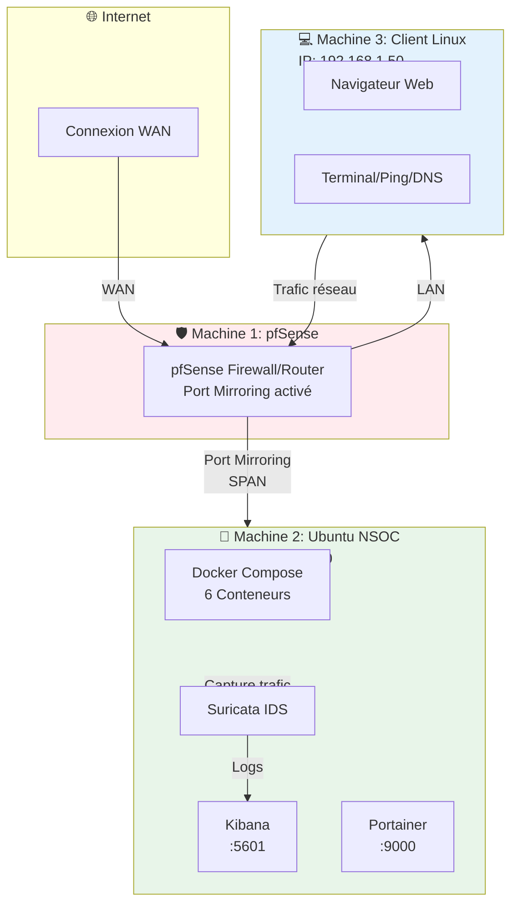
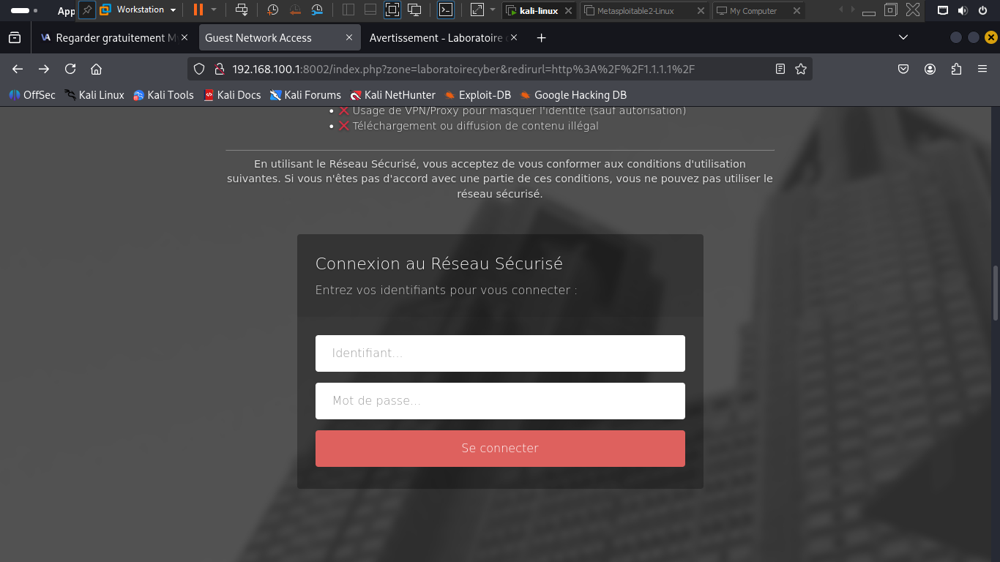
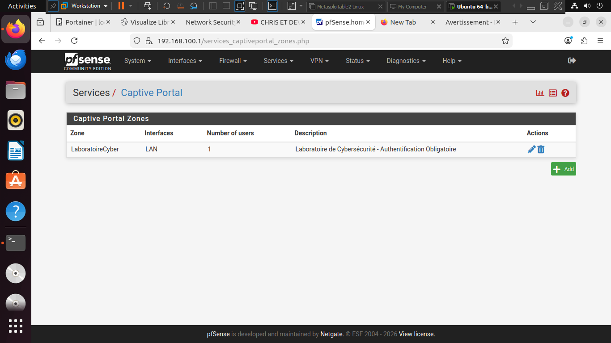
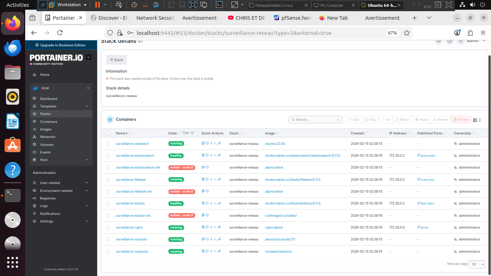
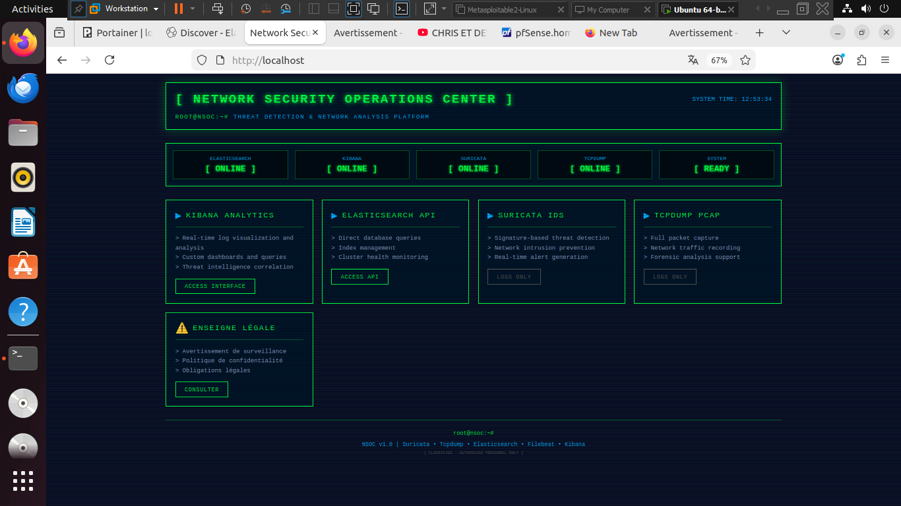

<div align="center">

# 🎓 École Supérieure Polytechnique de Dakar
## Université Cheikh Anta Diop (UCAD)

---

### Département de Génie Informatique
**Diplôme d'Ingénieur de Conception - DIC-3-GLSI**

---

# 🛡️ Projet NSOC
## Network Security Operations Center
### Guide d'Installation Privé
### Architecture Multi-Machines pour Laboratoire

---


---

### 👥 Groupe de Projet

**Membres:**
- **Salif Biaye**
- **Ndeye Astou Diagouraga**

---

**Année Académique:** 2025-2026
**Date:** Février 2026
**Version:** 2.1 - Simplifié

---

</div>

<div style="page-break-after: always;"></div>

---

# Guide d'Installation Privé - Laboratoire de Surveillance Réseau

<div align="center">

**🔒 Document Confidentiel - Usage Interne**

📍 **Institution:** École Supérieure Polytechnique (ESP) - UCAD
🎓 **Formation:** Département Génie Informatique - DIC-3-GLSI
👥 **Groupe:** Salif Biaye & Ndeye Astou Diagouraga
📅 **Date:** Février 2026 | **Version:** 2.1

**📋 Projet IntroSSI - Guide d'installation simplifié pour architecture 3 machines**

</div>

---

## 📋 Table des Matières

### 🏗️ Vue d'Ensemble
1. [Architecture du Laboratoire (3 machines)](#1-architecture-du-laboratoire)
2. [Schéma Réseau et Adresses IP](#2-schéma-réseau)
3. [Prérequis Globaux](#3-prérequis-globaux)

### 🛡️ PARTIE 1: Machine pfSense (Routeur/Firewall)
4. [Prérequis pfSense](#41-prérequis-pfsense)
5. [Configuration Port Mirroring (SPAN)](#42-configuration-port-mirroring)
6. [Vérification pfSense](#43-vérification-pfsense)

### 🐳 PARTIE 2: Machine Ubuntu (Serveur NSOC)
7. [Prérequis Ubuntu](#71-prérequis-ubuntu)
8. [Clone du Projet](#72-clone-du-projet)
9. [Configuration de l'Interface (ens33)](#73-configuration-de-linterface)
10. [Lancement Docker Compose](#74-lancement-docker-compose)
11. [Vérification via Portainer](#75-vérification-via-portainer)
12. [Vérification via Kibana](#76-vérification-via-kibana)

### 💻 PARTIE 3: Machine Cliente Linux
13. [Configuration Réseau](#131-configuration-réseau)
14. [Génération de Trafic](#132-génération-de-trafic)
15. [Vérification dans Kibana](#133-vérification-dans-kibana)

### 🔍 PARTIE 4: Validation et Maintenance
16. [Tests de Bout en Bout](#16-tests-de-bout-en-bout)
17. [Dépannage par Machine](#17-dépannage-par-machine)
18. [Commandes de Référence](#18-commandes-de-référence)

### 🎯 Conclusion
19. [Conclusion et Prochaines Étapes](#19-conclusion)

---

## 🏗️ 1. Architecture du Laboratoire

Ce laboratoire de surveillance réseau utilise une architecture à **3 machines virtuelles** interconnectées pour permettre la capture, l'analyse et la visualisation du trafic réseau en temps réel.

### 1.1 Schéma d'Architecture




### 1.2 Rôle de Chaque Machine

| Machine | Rôle | Services | Interface |
|---------|------|----------|-----------|
| **🛡️ pfSense** | Routeur/Firewall | Port mirroring, Routage, NAT | WAN: ens160<br/>LAN: ens192 |
| **🐳 Ubuntu NSOC** | Serveur de surveillance | Docker, Suricata, Kibana, Elasticsearch | ens33 (capture) |
| **💻 Client Linux** | Génération de trafic | Navigateur, outils réseau | ens33 |

### 1.3 Flux de Fonctionnement

```
📍 Étape 1: La machine Cliente génère du trafic réseau (navigation, ping, DNS)
       ↓
📍 Étape 2: Le trafic passe par le routeur pfSense
       ↓
📍 Étape 3: pfSense duplique le trafic via port mirroring (SPAN)
       ↓
📍 Étape 4: La machine Ubuntu NSOC capture le trafic dupliqué
       ↓
📍 Étape 5: Suricata analyse et enregistre les événements
       ↓
📍 Étape 6: Elasticsearch indexe les données
       ↓
📍 Étape 7: Kibana visualise les événements capturés
```

---

## 🌐 2. Schéma Réseau

### 2.1 Plan d'Adressage IP

```
Réseau LAN: 192.168.1.0/24

├── 192.168.1.1    → pfSense (Gateway + DHCP)
├── 192.168.1.100  → Ubuntu NSOC (Serveur de surveillance)
└── 192.168.1.50   → Client Linux (Machine de test)
```


### 2.2 Configuration Réseau Détaillée

| Machine | Hostname | Adresse IP | Gateway | Rôle |
|---------|----------|------------|---------|------|
| **pfSense** | pfsense.lab | 192.168.1.1/24 | - | Routeur principal |
| **Ubuntu NSOC** | nsoc-server.lab | 192.168.1.100/24 | 192.168.1.1 | Serveur de surveillance |
| **Client Linux** | client.lab | 192.168.1.50/24 | 192.168.1.1 | Machine de test |

---

## 💻 3. Prérequis Globaux

### 3.1 Matériel

**Configuration minimale (par machine):**
- **CPU:** 2 cœurs (Intel/AMD)
- **RAM:** 4 GB
- **Disque:** 50 GB d'espace libre
- **Réseau:** 1 interface Gigabit minimum

**Configuration recommandée:**
- **CPU:** 4+ cœurs
- **RAM:** 8 GB (surtout pour la machine Ubuntu NSOC)
- **Disque:** 200 GB SSD
- **Réseau:** 2 interfaces pour pfSense (WAN + LAN)

### 3.2 Logiciels Requis

**Machine pfSense:**
- ✅ pfSense 2.7+ déjà installé
- ✅ Accès interface web configuré

**Machine Ubuntu NSOC:**
- ✅ Ubuntu Server 22.04 LTS déjà installé
- ✅ Docker version 20.10+ déjà installé
- ✅ Docker Compose version 2.0+ déjà installé
- ✅ Git déjà installé
- ✅ Accès sudo disponible

**Machine Cliente Linux:**
- ✅ Distribution Linux (Ubuntu, Debian, Fedora, etc.)
- ✅ Navigateur web installé
- ✅ Outils réseau de base (ping, curl, wget)

### 3.3 Vérification Rapide (Machine Ubuntu)

```bash
# Vérifier Ubuntu
lsb_release -a  # Doit afficher Ubuntu 22.04 LTS

# Vérifier Docker
docker --version  # Version 20.10+

# Vérifier Docker Compose
docker compose version  # Version 2.0+

# Vérifier Git
git --version

# Vérifier accès sudo
sudo echo "OK"

# Vérifier interface réseau
ip link show ens33
```

**Si tout s'affiche correctement, vous êtes prêt à continuer!**

---

<div style="page-break-after: always;"></div>

---

# 🛡️ PARTIE 1: Machine pfSense (Routeur/Firewall)

## 4.1 Prérequis pfSense

**Avant de commencer, vérifier que:**

✅ pfSense est installé et accessible
✅ Vous avez accès à l'interface web pfSense
✅ Au moins 2 interfaces réseau sont configurées (WAN + LAN)
✅ Vous connaissez l'IP de l'interface web pfSense (généralement 192.168.1.1)

**Accès interface web:**
```
URL: https://192.168.1.1
Identifiant par défaut: admin
Mot de passe: pfsense (ou celui que vous avez configuré)
```



---

## 4.2 Configuration Port Mirroring

Le **port mirroring** (aussi appelé **SPAN** - Switched Port ANalyzer) permet de dupliquer le trafic réseau d'un port vers un autre port où est connecté le serveur de surveillance.

### 4.2.1 Identifier les Ports

Avant de configurer le port mirroring, identifiez:

1. **Port(s) source(s):** Le(s) port(s) dont vous voulez capturer le trafic
   - Exemple: `ens192` (interface LAN de pfSense)

2. **Port destination:** Le port connecté à la machine Ubuntu NSOC
   - Exemple: Port physique connecté à la machine Ubuntu

### 4.2.2 Configuration sur Switch Géré

**Sur un switch Cisco:**

```cisco
enable
configure terminal

! Créer une session SPAN
monitor session 1 source interface Gi0/1
monitor session 1 destination interface Gi0/24

! Gi0/1 = interface à surveiller (connexion pfSense LAN)
! Gi0/24 = interface du serveur Ubuntu NSOC

! Vérifier la configuration
show monitor session 1

! Sauvegarder
write memory
```

**Sur un switch Mikrotik RouterOS:**

```routeros
# Via Terminal (SSH/Console)

# Identifier le switch chip
/interface ethernet switch print

# Configurer le port mirroring
# ether5 = port du serveur Ubuntu NSOC
# ether2-ether4 = ports à surveiller (LAN)
/interface ethernet switch
set switch1 mirror-source=ether2,ether3,ether4 mirror-target=ether5

# Vérifier la configuration
/interface ethernet switch print detail
```

**Via WinBox (Interface graphique Mikrotik):**

1. Menu: `System → RouterBoard → Settings`
2. Onglet: `Switch`
3. Cocher: `Mirror to port` → Sélectionner `ether5`
4. `Mirror from`: Sélectionner `ether2, ether3, ether4`
5. Cliquer: `Apply`



### 4.2.3 Notes Importantes

**⚠️ Points à retenir:**
- Le port de destination (mirror target) ne doit **PAS** envoyer de trafic, seulement recevoir
- La machine Ubuntu NSOC doit être connectée au port de destination
- Le port mirroring peut impacter les performances du switch si beaucoup de trafic
- Testez avec un seul port source avant de tout surveiller

---

## 4.3 Vérification pfSense

### 4.3.1 Vérifier la Configuration

**Depuis l'interface web pfSense:**
1. Aller dans `Status → Interfaces`
2. Vérifier que les interfaces WAN et LAN sont **UP**
3. Noter l'adresse IP de l'interface LAN (devrait être 192.168.1.1)

### 4.3.2 Tester la Connectivité

**Depuis la machine Ubuntu NSOC:**

```bash
# Ping vers pfSense
ping -c 5 192.168.1.1

# Doit répondre avec succès
```

**Depuis la machine Cliente:**

```bash
# Ping vers pfSense
ping -c 5 192.168.1.1

# Doit répondre avec succès
```

✅ **Si les pings fonctionnent, le routage pfSense est opérationnel!**

---

<div style="page-break-after: always;"></div>

---

# 🐳 PARTIE 2: Machine Ubuntu (Serveur NSOC)

## 7.1 Prérequis Ubuntu

**Vérifications avant de commencer:**

```bash
# 1. Vérifier Ubuntu
lsb_release -a
# Attendu: Ubuntu 22.04 LTS

# 2. Vérifier Docker
docker --version
# Attendu: Docker version 20.10.0+

# 3. Vérifier Docker Compose
docker compose version
# Attendu: Docker Compose version v2.0.0+

# 4. Vérifier Git
git --version
# Attendu: git version 2.34.0+

# 5. Vérifier l'interface réseau
ip link show ens33
# Doit afficher l'interface ens33 en état UP
```

### 7.1.1 Configuration Système Requise

**Augmenter vm.max_map_count pour Elasticsearch:**

```bash
# Augmenter la limite (requis pour Elasticsearch)
echo "vm.max_map_count=262144" | sudo tee -a /etc/sysctl.conf

# Appliquer immédiatement
sudo sysctl -w vm.max_map_count=262144

# Vérifier
sysctl vm.max_map_count
# Doit afficher: vm.max_map_count = 262144
```

**⚠️ Important:** Cette étape est **obligatoire**, sinon Elasticsearch ne démarrera pas.

💡 **Note:** Cette configuration est **persistante** - elle survivra aux redémarrages du système grâce à l'écriture dans `/etc/sysctl.conf`.

---

## 7.2 Clone du Projet

### 7.2.1 Récupérer le Projet

```bash
# Option 1: Cloner depuis Git (recommandé)
git clone https://github.com/votre-compte/surveillance-reseau.git
cd surveillance-reseau/surveillance-reseau

# Option 2: Si vous avez reçu une archive
unzip surveillance-reseau.zip
cd surveillance-reseau/surveillance-reseau
```

### 7.2.2 Vérifier la Structure

```bash
# Vérifier que tous les fichiers sont présents
ls -la
```

**Structure attendue:**
```
surveillance-reseau/
├── docker-compose.yml      ← Orchestration Docker
├── .env                    ← Variables d'environnement
├── start.sh                ← Script de démarrage
├── README.md
├── configs/                ← Configurations Suricata, Filebeat, Nginx
│   ├── suricata/
│   ├── filebeat/
│   └── nginx/
├── data/                   ← Données PCAP, logs, Elasticsearch
│   ├── pcap/
│   ├── logs/
│   └── elasticsearch/
├── scripts/                ← Scripts utilitaires
└── docs/                   ← Documentation
```

✅ **Si tous les répertoires sont présents, continuez!**

---

## 7.3 Configuration de l'Interface

### 7.3.1 Identifier Votre Interface Réseau

```bash
# Lister les interfaces disponibles
ip link show

# Voir le trafic en temps réel sur l'interface
sudo tcpdump -i ens33 -c 10

# Si vous voyez des paquets défiler, ens33 est la bonne interface
```

**Interfaces courantes:**
- `ens33` - Interface VMware/VirtualBox standard
- `eth0` - Interface physique classique
- `enp0s3` - Interface moderne

### 7.3.2 Éditer le Fichier .env

```bash
# Ouvrir le fichier .env
nano .env
```

**Modifier la ligne CAPTURE_INTERFACE:**

```bash
# ============================================
# CONFIGURATION ENVIRONNEMENT
# ============================================

# Interface réseau à surveiller
CAPTURE_INTERFACE=ens33  # ← CHANGEZ ICI selon votre interface

# Elasticsearch
ES_MEMORY=2g  # 1g si vous avez 4GB RAM, 4g si 16GB RAM

# Rotation PCAP
PCAP_RETENTION_DAYS=7

# Logs retention
LOGS_RETENTION_DAYS=30

# Timezone
TZ=Africa/Dakar
```

**Sauvegarder et quitter:**
- Appuyez sur `Ctrl+O` puis `Entrée` pour sauvegarder
- Appuyez sur `Ctrl+X` pour quitter

### 7.3.3 Configurer les Permissions

```bash
# Créer les répertoires de données si nécessaire
mkdir -p data/{pcap,logs/suricata,elasticsearch}

# Permissions pour Elasticsearch (IMPORTANT)
# Elasticsearch s'exécute avec l'UID 1000 dans Docker
sudo chown -R 1000:1000 data/elasticsearch
chmod -R 700 data/elasticsearch

# Permissions pour les logs
chmod -R 755 data/logs data/pcap

# Permissions pour Filebeat (CRITIQUE)
sudo chown root:root configs/filebeat/filebeat.yml
sudo chmod 644 configs/filebeat/filebeat.yml
```

---

## 7.4 Lancement Docker Compose

### 7.4.1 Démarrer Tous les Services

```bash
# Se placer dans le répertoire du projet
cd /chemin/vers/surveillance-reseau/surveillance-reseau

# Démarrer tous les conteneurs en arrière-plan
docker compose up -d
```

**Ce qui se passe:**
1. ⬇️ Téléchargement des images Docker (première fois: 5-10 minutes)
2. 🏗️ Création du réseau Docker
3. 🚀 Démarrage des 6 conteneurs:
   - Elasticsearch (stockage)
   - Kibana (visualisation)
   - Suricata (IDS)
   - Tcpdump (capture PCAP)
   - Filebeat (envoi logs)
   - Nginx (page d'accueil)
4. ⏱️ Initialisation (2-3 minutes)

### 7.4.2 Attendre le Démarrage Complet

```bash
# Suivre les logs en temps réel
docker compose logs -f

# Appuyez sur Ctrl+C pour arrêter de suivre les logs
```

**⏱️ Attendez 2-3 minutes** que tous les services soient pleinement opérationnels.



### 7.4.3 Accès à la Page d'Accueil

**Ouvrir un navigateur et aller sur:**
```
http://192.168.1.100
```

**Vous devriez voir la page d'accueil du NSOC:**



**La page d'accueil offre:**
- Liens rapides vers Kibana, Elasticsearch, Portainer
- Statut des services
- Documentation accessible

### 7.4.4 Vérifier l'État des Conteneurs

```bash
# Voir l'état de tous les conteneurs
docker compose ps
```

**Sortie attendue:**
```
NAME                           STATUS
surveillance-elasticsearch     Up (healthy)
surveillance-kibana            Up (healthy)
surveillance-suricata          Up
surveillance-tcpdump           Up
surveillance-filebeat          Up
surveillance-nginx             Up
```

**✅ Tous les conteneurs doivent être "Up"**

**❌ Si un conteneur est en erreur:**
```bash
# Voir les logs du conteneur problématique
docker compose logs [nom-conteneur]

# Exemples:
docker compose logs elasticsearch
docker compose logs suricata
```

---

## 7.5 Vérification via Portainer

**Portainer** est une interface web pour gérer Docker facilement.

### 7.5.1 Accéder à Portainer

**Ouvrir un navigateur web et aller sur:**
```
http://192.168.1.100:9000
```

**Première connexion:**
1. Créer un compte admin
2. Choisir un mot de passe sécurisé
3. Cliquer sur "Create user"

### 7.5.2 Vérifier les Conteneurs

**Dans Portainer:**
1. Cliquer sur "Local" (environnement Docker local)
2. Aller dans "Containers"
3. Vérifier que **6 conteneurs** sont actifs:

**États attendus:**
- ✅ **surveillance-elasticsearch**: Running, Healthy
- ✅ **surveillance-kibana**: Running, Healthy
- ✅ **surveillance-suricata**: Running
- ✅ **surveillance-tcpdump**: Running
- ✅ **surveillance-filebeat**: Running
- ✅ **surveillance-nginx**: Running

### 7.5.3 Vérifier les Logs

**Dans Portainer:**
1. Cliquer sur un conteneur (ex: `surveillance-suricata`)
2. Cliquer sur "Logs"
3. Vérifier qu'il n'y a pas d'erreurs critiques

**Logs normaux de Suricata:**
```
<Notice> - all 4 packet processing threads, 4 management threads initialized, engine started.
<Info> - Stats: Total: 0 (Pkts/s: 0), Alert: 0 (Pkts/s: 0)
```

---

## 7.6 Vérification via Kibana

**Kibana** est l'interface de visualisation des données capturées.

### 7.6.1 Accéder à Kibana

**Ouvrir un navigateur et aller sur:**
```
http://192.168.1.100:5601
```

**Première ouverture:**
1. Cliquer sur "Explore on my own"
2. Patienter quelques secondes


### 7.6.2 Créer un Data View

**Les Data Views permettent de visualiser les données Elasticsearch.**

1. Dans Kibana, aller dans: **Menu (☰) → Management → Data Views**
2. Cliquer sur "Create data view"
3. Remplir les champs:
   - **Name:** `suricata-*`
   - **Index pattern:** `suricata-*`
   - **Timestamp field:** `@timestamp`
4. Cliquer sur "Save data view to Kibana"

### 7.6.3 Vérifier les Événements Capturés

1. Aller dans: **Menu (☰) → Analytics → Discover**
2. Sélectionner le data view: `suricata-*`
3. Ajuster la plage de temps: **Last 15 minutes**

**Vous devriez voir des événements capturés!**

**Si aucun événement:**
- ⏱️ Attendre 2-3 minutes supplémentaires
- Générer du trafic réseau (voir PARTIE 3)
- Vérifier les logs de Suricata: `docker compose logs suricata`

### 7.6.4 Vérifier les Différents Types d'Événements

**Dans Kibana Discover, rechercher:**

```
event_type:dns
```
→ Doit afficher les requêtes DNS capturées

```
event_type:flow
```
→ Doit afficher les flux réseau

```
event_type:alert
```
→ Doit afficher les alertes IDS (s'il y en a)


---

<div style="page-break-after: always;"></div>

---

# 💻 PARTIE 3: Machine Cliente Linux

## 13.1 Configuration Réseau

### 13.1.1 Vérifier la Connectivité

**Depuis la machine Cliente Linux:**

```bash
# Vérifier l'adresse IP
ip addr show

# Doit afficher une IP dans le réseau 192.168.1.0/24
# Exemple: 192.168.1.50
```

**Si pas d'IP configurée:**

```bash
# Configuration IP statique temporaire
sudo ip addr add 192.168.1.50/24 dev ens33
sudo ip route add default via 192.168.1.1

# Configuration DNS
echo "nameserver 8.8.8.8" | sudo tee /etc/resolv.conf
```

### 13.1.2 Tester la Connectivité

```bash
# Ping vers le gateway (pfSense)
ping -c 5 192.168.1.1

# Ping vers le serveur NSOC
ping -c 5 192.168.1.100

# Ping vers Internet
ping -c 5 8.8.8.8

# Test DNS
nslookup google.com
```

**✅ Si tous les pings fonctionnent, la configuration réseau est OK!**

---

## 13.2 Génération de Trafic

### 13.2.1 Trafic Web (HTTP/HTTPS)

```bash
# Navigation web basique
curl https://www.google.com
curl https://www.youtube.com
curl https://www.github.com

# Téléchargement d'un fichier
wget https://www.google.com/robots.txt

# Requêtes DNS multiples
for domain in google.com youtube.com facebook.com twitter.com; do
    nslookup $domain
    sleep 1
done
```

### 13.2.2 Trafic ICMP (Ping)

```bash
# Ping continu vers plusieurs destinations
ping -c 10 8.8.8.8
ping -c 10 1.1.1.1
ping -c 10 google.com
```

### 13.2.3 Trafic DNS

```bash
# Requêtes DNS multiples
dig google.com
dig youtube.com A
dig facebook.com AAAA
dig twitter.com MX
```

### 13.2.4 Navigation Web (avec Interface Graphique)

**Ouvrir un navigateur web (Firefox/Chrome) et visiter:**
- https://www.google.com
- https://www.youtube.com
- https://www.github.com
- https://www.wikipedia.org

### 13.2.5 Trafic de Test IDS

**Générer une alerte Suricata pour tester l'IDS:**

```bash
# Déclencher une alerte de test
curl http://testmyids.com

# Cette requête devrait générer une alerte dans Suricata
```

---

## 13.3 Vérification dans Kibana

### 13.3.1 Retour sur la Machine Ubuntu

**Depuis la machine Ubuntu NSOC, ouvrir Kibana:**
```
http://192.168.1.100:5601
```

### 13.3.2 Rechercher les Événements du Client

**Dans Kibana Discover:**

1. Sélectionner le data view: `suricata-*`
2. Plage de temps: **Last 15 minutes**
3. Rechercher par IP source:

```
src_ip:"192.168.1.50"
```

**Vous devriez voir tous les événements générés par le client!**

### 13.3.3 Analyser les Requêtes DNS

**Rechercher les requêtes DNS du client:**

```
src_ip:"192.168.1.50" AND event_type:"dns"
```

**Analyser les champs:**
- `dns.query.name` - Domaine interrogé
- `dns.query.type` - Type de requête (A, AAAA, MX, etc.)
- `dns.answers` - Réponses DNS

### 13.3.4 Vérifier les Alertes IDS

**Rechercher les alertes générées:**

```
event_type:"alert"
```

**Si vous avez fait `curl http://testmyids.com`, vous devriez voir:**
- Alert signature: "GPL ATTACK_RESPONSE id check returned root"
- Severity: High

---

<div style="page-break-after: always;"></div>

---

# 🔍 PARTIE 4: Validation et Maintenance

## 16. Tests de Bout en Bout

### 16.1 Checklist de Validation Complète

**Validez chaque étape pour confirmer que le laboratoire fonctionne correctement:**

**Machine pfSense:**
- [ ] pfSense accessible via interface web
- [ ] Port mirroring configuré et actif
- [ ] Interfaces WAN et LAN UP
- [ ] Routage fonctionnel (ping depuis client vers Internet)

**Machine Ubuntu NSOC:**
- [ ] Tous les 6 conteneurs Docker sont UP
- [ ] Elasticsearch répond sur port 9200
- [ ] Kibana accessible sur port 5601
- [ ] Portainer accessible sur port 9000
- [ ] Page d'accueil Nginx accessible sur port 80
- [ ] Fichiers PCAP créés dans `data/pcap/`
- [ ] Logs Suricata présents dans `data/logs/suricata/eve.json`
- [ ] Fichier `eve.json` grossit en temps réel
- [ ] Index `suricata-*` créés dans Elasticsearch
- [ ] Documents indexés dans Elasticsearch (count > 0)
- [ ] Recherche fonctionnelle dans Kibana

**Machine Cliente:**
- [ ] Connectivité réseau OK (ping vers pfSense, NSOC, Internet)
- [ ] Trafic web généré
- [ ] Requêtes DNS effectuées
- [ ] Événements visibles dans Kibana

### 16.2 Test de Bout en Bout Complet

**Scénario de test:**

```bash
# 1. Depuis la machine Cliente
ping -c 5 8.8.8.8
curl https://www.google.com
nslookup youtube.com

# 2. Depuis la machine Ubuntu NSOC
# Attendre 30 secondes puis vérifier les logs
tail -f data/logs/suricata/eve.json | jq 'select(.src_ip=="192.168.1.50")'

# 3. Dans Kibana (http://192.168.1.100:5601)
# Rechercher: src_ip:"192.168.1.50"
# Doit afficher les événements du client
```

**✅ Si vous voyez les événements du client dans Kibana, le système fonctionne parfaitement!**

---

## 17. Dépannage par Machine

### 17.1 Dépannage Machine pfSense

#### Problème: Pas de trafic capturé sur Ubuntu

**Diagnostic:**
```bash
# Sur Ubuntu NSOC, vérifier la capture
sudo tcpdump -i ens33 -c 50

# Si aucun paquet → problème de port mirroring
```

**Solutions:**
1. Vérifier que le port mirroring est bien configuré sur le switch
2. Vérifier que le câble est bien connecté au bon port
3. Vérifier que l'interface pfSense source est active
4. Redémarrer le switch si nécessaire

#### Problème: Client ne peut pas accéder à Internet

**Diagnostic:**
```bash
# Depuis le client
ping 192.168.1.1  # Test gateway
ping 8.8.8.8      # Test Internet
```

**Solutions:**
1. Vérifier la configuration NAT sur pfSense
2. Vérifier les règles firewall sur pfSense
3. Vérifier la passerelle par défaut du client

---

### 17.2 Dépannage Machine Ubuntu NSOC

#### Problème: Elasticsearch ne démarre pas

**Erreur:** "max virtual memory areas vm.max_map_count is too low"

**Solution:**
```bash
sudo sysctl -w vm.max_map_count=262144
echo "vm.max_map_count=262144" | sudo tee -a /etc/sysctl.conf
docker compose restart elasticsearch
```

#### Problème: Pas de capture réseau (fichiers PCAP vides)

**Diagnostic:**
```bash
# Vérifier l'interface disponible
ip link show

# Tester la capture manuelle
sudo tcpdump -i ens33 -c 10
```

**Solutions:**
```bash
# Si mauvaise interface dans .env
nano .env
# Modifier CAPTURE_INTERFACE avec la bonne interface

# Redémarrer les services de capture
docker compose restart tcpdump suricata
```

#### Problème: Kibana "Server is not ready yet"

**Solutions:**
```bash
# Attendre 2-3 minutes supplémentaires

# Vérifier qu'Elasticsearch est bien UP
curl http://localhost:9200/_cluster/health?pretty

# Vérifier les logs Kibana
docker compose logs kibana | tail -50

# Redémarrer Kibana
docker compose restart kibana
```

#### Problème: Filebeat "config file must be owned by root"

**Solution:**
```bash
# Corriger les permissions
sudo chown root:root configs/filebeat/filebeat.yml
sudo chmod 644 configs/filebeat/filebeat.yml

# Recréer le conteneur
docker compose rm -f filebeat
docker compose up -d filebeat
```

#### Problème: Services lents ou manque de mémoire

**Diagnostic:**
```bash
# Voir l'utilisation RAM
free -h
docker stats
```

**Solution:**
```bash
# Réduire la RAM d'Elasticsearch
nano .env
# Changer ES_MEMORY=2g → ES_MEMORY=1g

# Redémarrer
docker compose restart elasticsearch
```

#### Problème: Suricata ne capture pas

**Diagnostic:**
```bash
# Vérifier les logs Suricata
docker compose logs suricata | tail -50

# Vérifier l'interface réseau
ip link show ens33
```

**Solutions:**
```bash
# Vérifier que l'interface est correcte dans .env
nano .env

# Redémarrer Suricata
docker compose restart suricata

# Vérifier que des paquets arrivent
sudo tcpdump -i ens33 -c 10
```

#### Problème: Permission denied sur les volumes

**Solution:**
```bash
# Corriger les permissions
sudo chmod -R 777 data/elasticsearch
sudo chmod -R 755 data/logs data/pcap
sudo chown -R 1000:1000 data/elasticsearch
```

---

### 17.3 Dépannage Machine Cliente

#### Problème: Pas de connectivité réseau

**Diagnostic:**
```bash
# Vérifier l'interface
ip addr show

# Vérifier la route par défaut
ip route show

# Ping vers gateway
ping -c 5 192.168.1.1
```

**Solutions:**
```bash
# Reconfigurer l'IP
sudo ip addr add 192.168.1.50/24 dev ens33
sudo ip route add default via 192.168.1.1

# Configurer DNS
echo "nameserver 8.8.8.8" | sudo tee /etc/resolv.conf
```

#### Problème: Événements client pas visibles dans Kibana

**Diagnostic:**
```bash
# Sur Ubuntu NSOC, vérifier que le trafic est capturé
sudo tcpdump -i ens33 host 192.168.1.50 -c 20
```

**Solutions:**
1. Vérifier que le port mirroring est actif
2. Générer plus de trafic depuis le client
3. Attendre 1-2 minutes pour l'indexation dans Elasticsearch
4. Vérifier les logs Filebeat: `docker compose logs filebeat`

---

## 18. Commandes de Référence

### 18.1 Commandes Machine Ubuntu NSOC

**Gestion Docker Compose:**
```bash
# DÉMARRAGE
cd /chemin/vers/surveillance-reseau/surveillance-reseau
docker compose up -d

# ARRÊT
docker compose down

# REDÉMARRAGE COMPLET
docker compose restart

# REDÉMARRER UN SERVICE SPÉCIFIQUE
docker compose restart [service]
# Exemples: elasticsearch, kibana, suricata, tcpdump, filebeat, nginx

# VOIR L'ÉTAT DES CONTENEURS
docker compose ps

# VOIR LES LOGS
docker compose logs                    # Tous les services
docker compose logs -f [service]       # Un service en temps réel
docker compose logs --tail 50 [service] # 50 dernières lignes

# STATS RESSOURCES
docker stats

# ENTRER DANS UN CONTENEUR
docker compose exec [service] bash
```

**Vérification des Captures:**
```bash
# VOIR LES FICHIERS PCAP
ls -lh data/pcap/$(date +%Y-%m-%d)/

# VOIR LES LOGS SURICATA
tail -f data/logs/suricata/eve.json

# VOIR LES LOGS SURICATA FORMATÉS (avec jq)
tail -f data/logs/suricata/eve.json | jq '.'

# COMPTER LES ÉVÉNEMENTS CAPTURÉS
wc -l data/logs/suricata/eve.json

# VOIR SEULEMENT LES ALERTES
tail -f data/logs/suricata/eve.json | jq 'select(.event_type=="alert")'

# VOIR SEULEMENT LES REQUÊTES DNS
tail -f data/logs/suricata/eve.json | jq 'select(.event_type=="dns")'

# VOIR SEULEMENT LES FLUX RÉSEAU
tail -f data/logs/suricata/eve.json | jq 'select(.event_type=="flow")'
```

**Vérification Elasticsearch:**
```bash
# VÉRIFIER L'ÉTAT DU CLUSTER
curl http://localhost:9200/_cluster/health?pretty

# LISTER LES INDEX
curl http://localhost:9200/_cat/indices?v

# COMPTER LES DOCUMENTS INDEXÉS
curl -s "http://localhost:9200/suricata-*/_count" | jq '.'

# VOIR UN EXEMPLE DE DOCUMENT
curl -s "http://localhost:9200/suricata-*/_search?size=1&pretty"

# SUPPRIMER UN INDEX (ATTENTION: perte de données)
curl -X DELETE "http://localhost:9200/suricata-2026.02.15"
```

**Monitoring Système:**
```bash
# ESPACE DISQUE
df -h

# MÉMOIRE RAM
free -h

# UTILISATION CPU/RAM EN TEMPS RÉEL
htop

# TRAFIC RÉSEAU
sudo tcpdump -i ens33 -c 50

# STATS INTERFACE RÉSEAU
ifstat -i ens33
```

**Commandes Utiles (Manuelles):**
```bash
# BACKUP DES CONFIGURATIONS (à faire manuellement)
tar -czf backup-configs-$(date +%F).tar.gz configs/ .env docker-compose.yml

# La placer dans un endroit sûr
mv backup-configs-*.tar.gz ~/backups/

# NETTOYAGE PCAP ANCIEN (si espace disque faible)
# ⚠️ ATTENTION: Supprime les données > 7 jours!
find data/pcap/ -type f -mtime +7 -delete

# Vérifier l'espace libéré
df -h

# METTRE À JOUR LES IMAGES DOCKER
docker compose pull
docker compose up -d
```

⚠️ **Note:** Ces commandes sont à exécuter **manuellement** selon vos besoins. Aucune automatisation (crontab) n'a été configurée.

---

### 18.2 Commandes Machine Cliente

**Tests de Connectivité:**
```bash
# PING VERS GATEWAY
ping -c 5 192.168.1.1

# PING VERS SERVEUR NSOC
ping -c 5 192.168.1.100

# PING VERS INTERNET
ping -c 5 8.8.8.8

# TEST DNS
nslookup google.com
dig youtube.com
```

**Génération de Trafic:**
```bash
# TRAFIC WEB
curl https://www.google.com
wget https://www.github.com/robots.txt

# TRAFIC DNS
for domain in google.com youtube.com facebook.com; do
    nslookup $domain
    sleep 1
done

# DÉCLENCHER ALERTE IDS
curl http://testmyids.com
```

---

### 18.3 URLs d'Accès

**Depuis un navigateur sur le réseau 192.168.1.0/24:**

| Service | URL | Description |
|---------|-----|-------------|
| **pfSense** | https://192.168.1.1 | Interface web pfSense |
| **Page d'accueil NSOC** | http://192.168.1.100 | Page d'accueil HTML |
| **Kibana** | http://192.168.1.100:5601 | Visualisation données |
| **Elasticsearch** | http://192.168.1.100:9200 | API Elasticsearch |
| **Portainer** | http://192.168.1.100:9000 | Gestion Docker |

**Page d'accueil NSOC (http://192.168.1.100):**


---

<div style="page-break-after: always;"></div>

---

## 🎯 19. Conclusion

<div align="center">

### ✨ Installation Complète en 3 Machines ✨

</div>

**🎓 Félicitations!** Votre plateforme de surveillance réseau NSOC est opérationnelle avec une architecture professionnelle à 3 machines.

### 📊 Ce que vous avez accompli:

| ✅ Étape | 📝 Réalisation |
|----------|----------------|
| **1. pfSense** | Routeur configuré avec port mirroring actif |
| **2. Ubuntu NSOC** | 6 conteneurs Docker déployés et opérationnels |
| **3. Client Linux** | Machine de test générant du trafic réseau |
| **4. Capture** | PCAP + IDS Suricata capturant le trafic en temps réel |
| **5. Visualisation** | Kibana affichant les événements du client |

### 🔄 Architecture Opérationnelle:

```
Client Linux → Trafic réseau → pfSense (port mirroring) → Ubuntu NSOC → Kibana
```

**📈 Résultat:** Le trafic de la machine cliente est capturé, analysé et visualisé en temps réel!

### 🚀 Prochaines Étapes Recommandées:

1. **📚 Consulter l'architecture:** Lisez `architecture-publique.md` pour comprendre le système en détail
2. **📊 Créer des dashboards:** Personnalisez vos visualisations dans Kibana
3. **🔍 Explorer les données:** Utilisez les recherches KQL dans Kibana:
   - `event_type:dns` - Requêtes DNS
   - `event_type:alert` - Alertes IDS
   - `src_ip:"192.168.1.50"` - Trafic du client
4. **⚙️ Ajouter des règles Suricata:** Créez vos propres règles de détection
5. **📈 Analyser les statistiques:** Utilisez les visualisations pour identifier les tendances

### 🛡️ Bonnes Pratiques:

- **🔒 Sécurité:** Changez les mots de passe par défaut (Portainer, pfSense)
- **💾 Backup:** Sauvegardez régulièrement vos configurations
- **🧹 Nettoyage:** Configurez la rotation automatique des PCAP et logs
- **📊 Monitoring:** Vérifiez quotidiennement l'espace disque et la RAM
- **🔄 Mise à jour:** Mettez à jour les images Docker régulièrement

### 📚 Documentation Complémentaire:

Ce guide d'installation fait partie d'un ensemble de documentation technique du projet NSOC:
- `architecture-publique.md` - Architecture détaillée du système
- `README.md` - Vue d'ensemble du projet
- `SURICATA.md` - Configuration avancée de Suricata
- `KIBANA.md` - Guide d'utilisation de Kibana

### 🐛 En Cas de Problème:

Consultez la section [17. Dépannage par Machine](#17-dépannage-par-machine) de ce guide.

---

**📄 Métadonnées du Document**

| Champ | Valeur |
|-------|--------|
| **Document** | Guide d'Installation Privé - NSOC |
| **Classification** | 🔒 Confidentiel - Usage Interne |
| **Version** | 2.1 - Simplifié (Architecture 3 Machines) |
| **Date** | Février 2026 |
| **Auteurs** | Salif Biaye, Ndeye Astou Diagouraga |
| **Institution** | ESP - UCAD, Dakar |
| **Formation** | DIC-3-GLSI - Génie Informatique |
| **Projet** | Network Security Operations Center |
| **Méthode** | Déploiement Docker Multi-Machines |

---

<div align="center">

**🔒 Document Confidentiel - Ne Pas Diffuser**

**Made with ❤️ for Cybersecurity Education**

🛡️ **NSOC** - Protecting Networks, One Packet at a Time

</div>
