<div align="center">

# 🎓 École Supérieure Polytechnique de Dakar
## Université Cheikh Anta Diop (UCAD)

---

### Département de Génie Informatique
**Diplôme d'Ingénieur de Conception — DIC-3-GLSI**

---

# 🛡️ Projet NSOC
## Network Security Operations Center
### Guide d'Installation Privé
### Architecture Multi-Machines pour Laboratoire

---


---

### 👥 Groupe de Projet

**Membres :**
- **Salif Biaye**
- **Ndeye Astou Diagouraga**

---

**Année Académique :** 2025-2026
**Date :** Février 2026
**Version :** 3.0 — Stack 12 services + Arkime v5

---

</div>

<div style="page-break-after: always;"></div>

---

# Guide d'Installation Privé — Laboratoire de Surveillance Réseau

<div align="center">

**🔒 Document Confidentiel — Usage Interne**

📍 **Institution :** École Supérieure Polytechnique (ESP) — UCAD
🎓 **Formation :** Département Génie Informatique — DIC-3-GLSI
👥 **Groupe :** Salif Biaye & Ndeye Astou Diagouraga
📅 **Date :** Février 2026 | **Version :** 3.0

</div>

---

## 📋 Table des Matières

### 🏗️ Vue d'Ensemble
1. [Architecture du Laboratoire (3 machines)](#1-architecture-du-laboratoire)
2. [Schéma Réseau et Adresses IP](#2-schéma-réseau)
3. [Prérequis Globaux](#3-prérequis-globaux)

### 🛡️ PARTIE 1 : Machine pfSense (Routeur/Firewall)
4. [Prérequis pfSense](#41-prérequis-pfsense)
5. [Configuration Port Mirroring (SPAN)](#42-configuration-port-mirroring)
6. [Vérification pfSense](#43-vérification-pfsense)

### 🐳 PARTIE 2 : Machine Ubuntu (Serveur NSOC)
7. [Prérequis Ubuntu](#71-prérequis-ubuntu)
8. [Clone du Projet](#72-clone-du-projet)
9. [Configuration de l'Interface](#73-configuration-de-linterface)
10. [Lancement Docker Compose (12 services)](#74-lancement-docker-compose)
11. [Vérification via Portainer](#75-vérification-via-portainer)
12. [Vérification via Kibana](#76-vérification-via-kibana)
13. [Vérification Arkime v5](#77-vérification-arkime)
14. [Vérification Enseigne Légale](#78-vérification-enseigne)
15. [Vérification Status API](#79-vérification-status-api)

### 💻 PARTIE 3 : Machine Cliente Linux
16. [Configuration Réseau](#161-configuration-réseau)
17. [Génération de Trafic](#162-génération-de-trafic)
18. [Vérification dans Kibana](#163-vérification-dans-kibana)

### 🔍 PARTIE 4 : Validation et Maintenance
19. [Checklist de Validation Complète](#19-checklist-de-validation)
20. [Tests de Bout en Bout](#20-tests-de-bout-en-bout)
21. [Dépannage par Machine](#21-dépannage)
22. [Commandes de Référence](#22-commandes-de-référence)

### 🎬 PARTIE 5 : Démonstrations Vidéo
23. [Liens Vidéo](#23-vidéos)

### 🎯 Conclusion
24. [Conclusion et Prochaines Étapes](#24-conclusion)

---

## 🏗️ 1. Architecture du Laboratoire

Ce laboratoire de surveillance réseau utilise une architecture à **3 machines virtuelles** interconnectées.

### 1.1 Schéma d'Architecture

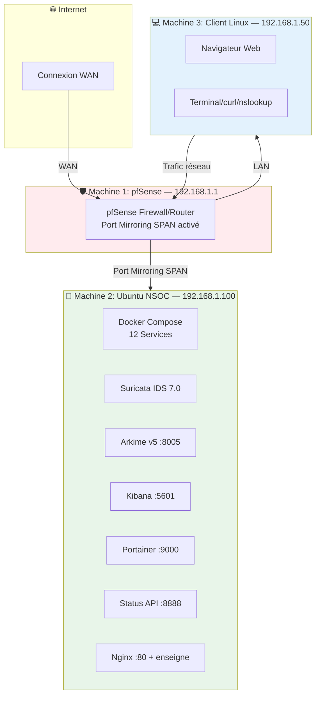
```mermaid
graph TB
    subgraph Internet["🌐 Internet"]
        WAN[Connexion WAN]
    end

    subgraph pfSense["🛡️ Machine 1: pfSense — 192.168.1.1"]
        PF[pfSense Firewall/Router<br/>Port Mirroring SPAN activé]
    end

    subgraph Ubuntu["🐳 Machine 2: Ubuntu NSOC — 192.168.1.100"]
        Docker[Docker Compose<br/>12 Services]
        Suricata[Suricata IDS 7.0]
        Arkime[Arkime v5 :8005]
        Kibana[Kibana :5601]
        Portainer[Portainer :9000]
        StatusAPI[Status API :8888]
        Nginx[Nginx :80 + enseigne]
    end

    subgraph Client["💻 Machine 3: Client Linux — 192.168.1.50"]
        Browser[Navigateur Web]
        Terminal[Terminal/curl/nslookup]
    end

    WAN -->|WAN| PF
    PF -->|LAN| Client
    PF -->|Port Mirroring SPAN| Ubuntu
    Client -->|Trafic réseau| PF

    style pfSense fill:#ffebee
    style Ubuntu fill:#e8f5e9
    style Client fill:#e3f2fd
```

### 1.2 Rôle de Chaque Machine

| Machine | Rôle | Services Clés | IP |
|---------|------|--------------|-----|
| **🛡️ pfSense** | Routeur/Firewall | Port mirroring, NAT, Firewall | 192.168.1.1 |
| **🐳 Ubuntu NSOC** | Serveur de surveillance | 12 containers Docker | 192.168.1.100 |
| **💻 Client Linux** | Génération de trafic | Navigateur, outils réseau | 192.168.1.50 |

### 1.3 Flux de Fonctionnement

```
📍 Étape 1: La machine Cliente génère du trafic réseau
       ↓
📍 Étape 2: Le trafic passe par le routeur pfSense
       ↓
📍 Étape 3: pfSense duplique le trafic via port mirroring (SPAN)
       ↓
📍 Étape 4: Ubuntu NSOC capture le trafic (Suricata + Arkime)
       ↓
📍 Étape 5: Suricata analyse → eve.json → Filebeat → Elasticsearch
       ↓
📍 Étape 6: Arkime indexe les sessions PCAP
       ↓
📍 Étape 7: Kibana visualise + Arkime permet l'analyse PCAP
```

---

## 🌐 2. Schéma Réseau

### 2.1 Plan d'Adressage IP

```
Réseau LAN: 192.168.1.0/24

├── 192.168.1.1    → pfSense (Gateway + DHCP)
├── 192.168.1.100  → Ubuntu NSOC (Serveur de surveillance)
└── 192.168.1.50   → Client Linux (Machine de test)
```

### 2.2 Ports Exposés sur Ubuntu NSOC

| Port | Service | URL |
|------|---------|-----|
| **80** | Nginx (Dashboard + Enseigne) | `http://192.168.1.100` |
| **5601** | Kibana | `http://192.168.1.100:5601` |
| **8005** | Arkime v5 | `http://192.168.1.100:8005` |
| **8888** | Status API | `http://192.168.1.100:8888/health` |
| **9000** | Portainer | `http://192.168.1.100:9000` |
| **9200** | Elasticsearch API | `http://192.168.1.100:9200` |

---

<div style="page-break-after: always;"></div>

## 💻 3. Prérequis Globaux

### 3.1 Matériel (par machine)

**Configuration minimale :**
- CPU : 2 cœurs
- RAM : 4 GB (8 GB pour Ubuntu NSOC)
- Disque : 50 GB libre (200 GB SSD recommandé pour NSOC)
- Réseau : 1 interface Gigabit

### 3.2 Logiciels Requis

**Machine pfSense :**
- ✅ pfSense 2.7+ installé et accessible
- ✅ Au moins 2 interfaces (WAN + LAN)

**Machine Ubuntu NSOC :**
- ✅ Ubuntu Server 22.04 LTS
- ✅ Docker version 20.10+
- ✅ Docker Compose version 2.0+
- ✅ Git installé
- ✅ Accès sudo disponible

**Machine Cliente Linux :**
- ✅ Distribution Linux (Ubuntu, Debian, Fedora…)
- ✅ Navigateur web installé
- ✅ Outils réseau (ping, curl, nslookup, dig)

### 3.3 Vérification Rapide

```bash
# Sur Ubuntu NSOC — vérifier l'environnement
lsb_release -a          # Ubuntu 22.04 LTS
docker --version        # Docker 20.10+
docker compose version  # Docker Compose v2.0+
git --version
sudo echo "sudo OK"
ip link show ens33      # Interface réseau UP
```

---

<div style="page-break-after: always;"></div>

# 🛡️ PARTIE 1 : Machine pfSense (Routeur/Firewall)

## 4.1 Prérequis pfSense

**Accès interface web pfSense :**

```
URL:  https://192.168.1.1
User: admin
Pass: pfsense (ou votre mot de passe)
```

**Page de login pfSense :**

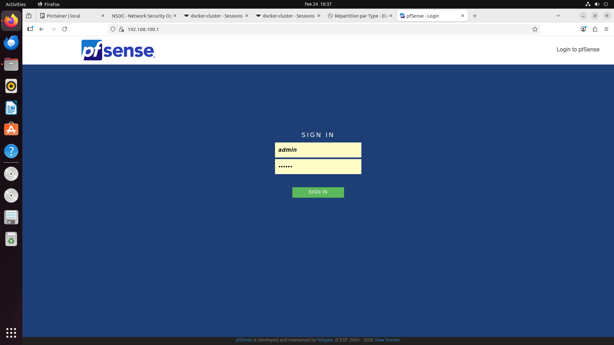

**Vérifications avant de commencer :**
- [ ] pfSense accessible via l'interface web
- [ ] Au moins 2 interfaces configurées (WAN + LAN)
- [ ] IP LAN = 192.168.1.1

---

## 4.2 Configuration Port Mirroring (SPAN)

Le **port mirroring** (SPAN) duplique le trafic réseau vers le serveur de surveillance.

### Sur switch Cisco

```cisco
enable
configure terminal

monitor session 1 source interface Gi0/1
monitor session 1 destination interface Gi0/24
! Gi0/1 = interface LAN pfSense
! Gi0/24 = interface Ubuntu NSOC

show monitor session 1
write memory
```

### Sur switch Mikrotik

```routeros
/interface ethernet switch
set switch1 mirror-source=ether2,ether3,ether4 mirror-target=ether5
! ether5 = port Ubuntu NSOC

/interface ethernet switch print detail
```

> ⚠️ **ATTENTION :** Le port destination (mirror target) ne doit **pas** envoyer de trafic, seulement recevoir.

---

## 4.3 Vérification pfSense

### Dashboard pfSense — Interfaces UP

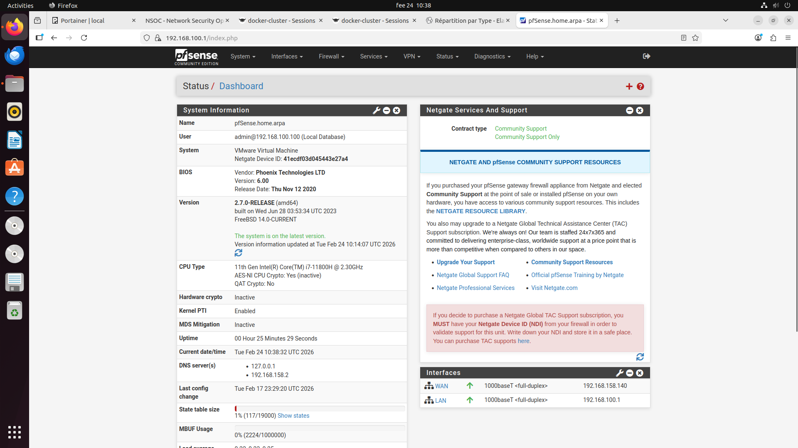

### Règles Firewall LAN

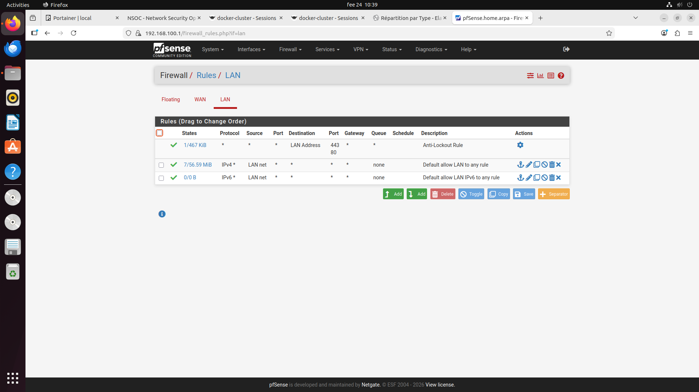

### Table ARP

**Diagnostics → ARP Table :**

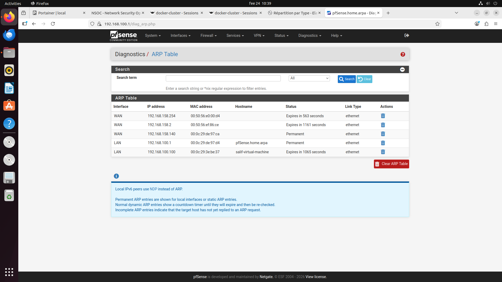

### Test de connectivité

```bash
# Depuis Ubuntu NSOC
ping -c 5 192.168.1.1   # → doit répondre OK

# Depuis la machine cliente
ping -c 5 192.168.1.1   # → doit répondre OK
```

> ✅ **SUCCÈS :** Si les pings fonctionnent, le routage pfSense est opérationnel.

---

<div style="page-break-after: always;"></div>

# 🐳 PARTIE 2 : Machine Ubuntu (Serveur NSOC)

## 7.1 Prérequis Ubuntu

### Configuration système requise pour Elasticsearch

```bash
# Augmenter vm.max_map_count (obligatoire pour ES)
echo "vm.max_map_count=262144" | sudo tee -a /etc/sysctl.conf
sudo sysctl -w vm.max_map_count=262144

# Vérifier
sysctl vm.max_map_count
# Attendu: vm.max_map_count = 262144
```

> ⚠️ **ATTENTION :** Cette étape est **obligatoire**. Sans elle, Elasticsearch refusera de démarrer.

---

## 7.2 Clone du Projet

```bash
# Option 1: Cloner depuis Git (recommandé)
git clone https://github.com/votre-compte/surveillance-reseau.git
cd surveillance-reseau/surveillance-reseau

# Option 2: Archive ZIP
unzip surveillance-reseau.zip
cd surveillance-reseau/surveillance-reseau
```

**Structure attendue :**
```
surveillance-reseau/
├── docker-compose.yml
├── .env
├── start.sh
├── configs/
│   ├── suricata/
│   ├── filebeat/
│   ├── arkime/
│   └── nginx/
│       └── html/
│           ├── index.html
│           └── enseigne.html
├── data/
│   ├── pcap/
│   ├── logs/
│   ├── elasticsearch/
│   └── arkime/
└── docs/
```

---

## 7.3 Configuration de l'Interface

### Identifier votre interface réseau

```bash
ip link show
sudo tcpdump -i ens33 -c 10   # Vérifier que des paquets arrivent
```

### Éditer le fichier `.env`

```bash
nano .env
```

```bash
# Interface réseau à surveiller
CAPTURE_INTERFACE=ens33    # ← Adapter selon votre interface

# Elasticsearch
ES_MEMORY=2g               # 1g si 4 GB RAM, 4g si 16 GB RAM

# Rétention
PCAP_RETENTION_DAYS=7
LOGS_RETENTION_DAYS=30

# Timezone
TZ=Africa/Dakar
```

### Configurer les permissions

```bash
mkdir -p data/{pcap,logs/suricata,logs/arpwatch,elasticsearch,arkime}

# Elasticsearch (UID 1000 dans Docker)
sudo chown -R 1000:1000 data/elasticsearch
chmod -R 700 data/elasticsearch

# Logs et PCAP
chmod -R 755 data/logs data/pcap data/arkime

# Filebeat (critique)
sudo chown root:root configs/filebeat/filebeat.yml
sudo chmod 644 configs/filebeat/filebeat.yml
```

---

## 7.4 Lancement Docker Compose

### Démarrer les 12 services

```bash
cd /chemin/vers/surveillance-reseau/surveillance-reseau
docker compose up -d
```

**Séquence de démarrage :**
```
1. ⬇️ Téléchargement des images (1ère fois: 10-15 min)
2. 🏗️ Création du réseau Docker surveillance-net
3. 🚀 Démarrage des 12 containers
4. ⏱️ Initialisation ES + Kibana (2-3 min)
5. ✅ kibana-init configure les Data Views et Dashboards
```

### Vérifier l'état

```bash
docker compose ps
```

**Sortie attendue (12 containers UP) :**
```
NAME                              STATUS
surveillance-elasticsearch        Up (healthy)
surveillance-kibana               Up (healthy)
surveillance-suricata             Up
surveillance-tcpdump              Up
surveillance-arpwatch             Up
surveillance-filebeat             Up
surveillance-arkime-capture       Up
surveillance-arkime               Up
surveillance-nginx                Up
surveillance-portainer            Up
surveillance-status-api           Up
surveillance-kibana-init          Exited (0)   ← Normal après init
```

> ✅ **SUCCÈS :** Tous les containers doivent être `Up`. `kibana-init` peut être `Exited (0)` (exécution unique).

> ⚠️ **ATTENTION :** Si un container est en erreur, consulter la [section dépannage](#21-dépannage).

---

## 7.5 Vérification via Portainer

**Accès :** `http://192.168.1.100:9000`

**Première connexion :** Créer un compte administrateur.

### Containers dans Portainer

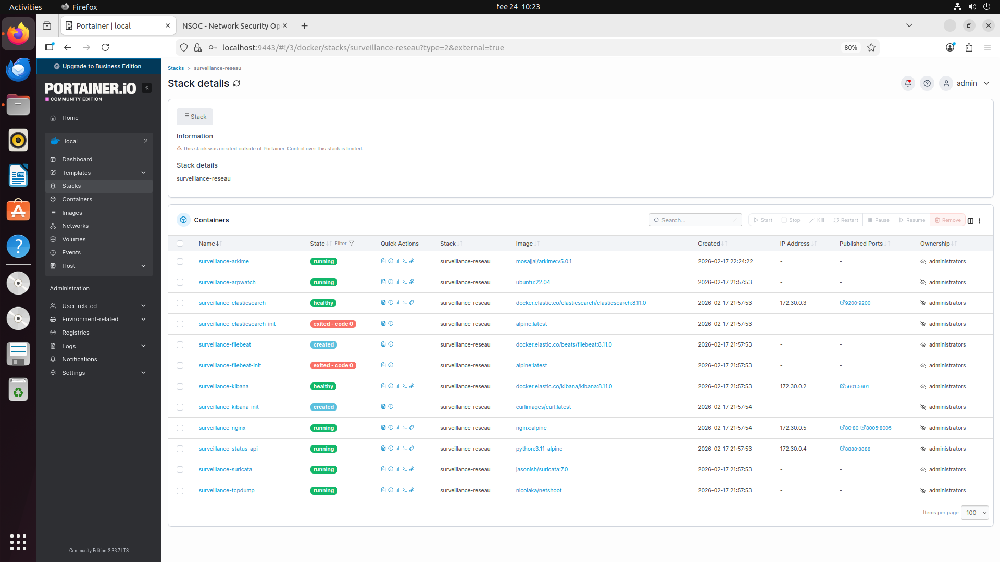

**Dans Portainer : Containers → vérifier que 7+ containers sont `Running`**

### Logs d'un container (Suricata)

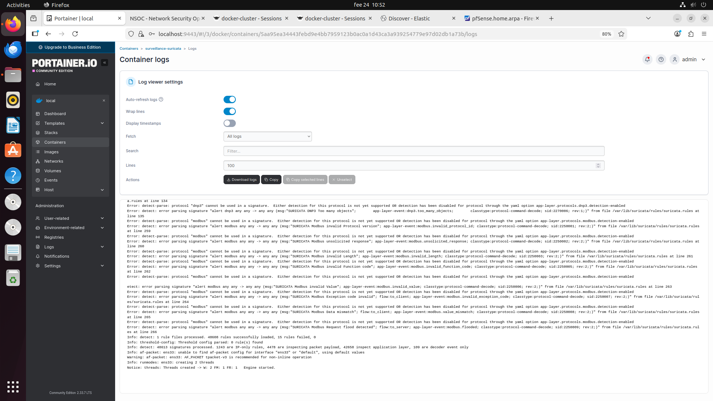

**Logs normaux de Suricata :**
```
<Notice> - all 4 packet processing threads initialized, engine started.
<Info> - Stats: Total: 0 (Pkts/s: 0), Alert: 0 (Pkts/s: 0)
```

---

## 7.6 Vérification via Kibana

**Accès :** `http://192.168.1.100:5601`
**Credentials :** `elastic` / `changeme`

### Créer un Data View (si non créé automatiquement)

```
Menu (☰) → Management → Data Views → Create data view
Name: suricata-*
Index pattern: suricata-*
Timestamp field: @timestamp
→ Save data view to Kibana
```

> 💡 **INFO :** Kibana reçoit des logs de **3 sources distinctes** — choisir le bon Data View selon ce qu'on veut analyser :
>
> | Data View | Source | Ce qu'on y trouve |
> |-----------|--------|------------------|
> | `suricata-*` | Suricata IDS | dns, tls, alert, http, flow |
> | `arpwatch-*` | ARPWatch | new station, changed mac, flip-flop |
> | `pfsense-*` | pfSense Firewall | règles firewall, trafic bloqué, DHCP |

### Vérifier les événements Suricata

```
Menu (☰) → Analytics → Discover
Data view: suricata-*
Plage: Last 15 minutes
```

**Filtrer par type d'event :**
```kql
event_type: "dns"     → Requêtes DNS capturées
event_type: "tls"     → Connexions HTTPS (SNI visible)
event_type: "alert"   → Alertes IDS Suricata
event_type: "flow"    → Flux réseau
```

### Vérifier les événements ARPWatch

```
Menu (☰) → Analytics → Discover
Data view: arpwatch-*
Plage: Last 1 hour
```

**Types d'events :**
```kql
event_type: "new station"    → Nouvel équipement détecté
event_type: "changed mac"    → ⚠️ ARP spoofing potentiel !
event_type: "flip-flop"      → ⚠️ Attaque MITM potentielle !
ip: "192.168.1.50"           → Events liés au client
```

### Vérifier les logs pfSense

```
Menu (☰) → Analytics → Discover
Data view: pfsense-*
Plage: Last 15 minutes
```

**Filtres utiles :**
```kql
action: "block"              → Trafic bloqué par le firewall
src_ip: "192.168.1.50"       → Trafic du client
dest_port: 80                → Connexions HTTP
dest_port: 443               → Connexions HTTPS
```

### Vérifier les Dashboards

```
Menu (☰) → Analytics → Dashboards
→ Dashboard #1 : Vue d'ensemble (Suricata + ARPWatch + pfSense)
→ Dashboard #2 : Alertes IDS en temps réel
```

> 💡 **INFO :** Si aucun événement n'apparaît dans un index, vérifiez que la source correspondante est bien active : `docker compose logs suricata`, `docker compose logs arpwatch`, et que pfSense envoie bien ses syslog vers le serveur NSOC.

---

## 7.7 Vérification Arkime v5

**Accès :** `http://192.168.1.100:8005`
**Credentials :** `admin` / `admin`

### Sessions PCAP

```
1. Naviguer vers http://192.168.1.100:8005
2. Login: admin / admin
3. Onglet "Sessions" → liste des sessions réseau capturées
```

> ✅ **SUCCÈS :** Des sessions réseau doivent apparaître dans la liste Arkime.

**Vérification via curl :**
```bash
# Test de connectivité Arkime
curl -u admin:admin http://localhost:8005/api/sessions
```

---

## 7.8 Vérification Enseigne Légale

**Accès :** `http://192.168.1.100/enseigne.html`

**Test depuis Ubuntu NSOC :**
```bash
curl -s http://localhost/enseigne.html | head -20
```

**Test depuis la machine cliente :**
```bash
curl -s http://192.168.1.100/enseigne.html
```

> ✅ **SUCCÈS :** La page enseigne doit afficher l'avertissement de surveillance réseau.

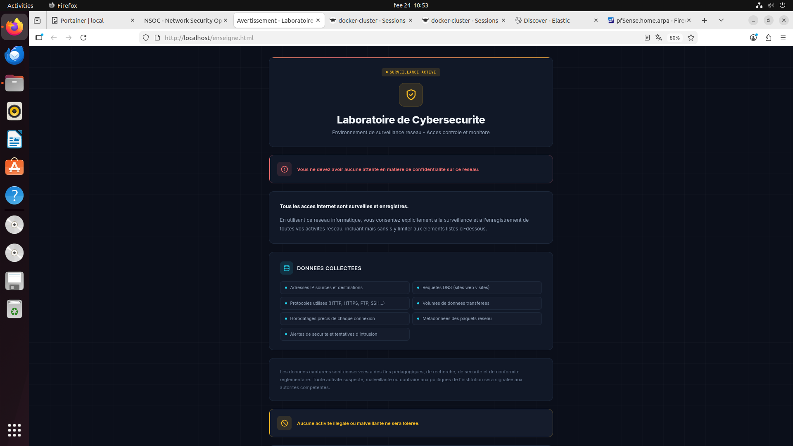

---

## 7.9 Vérification Status API

**Accès :** `http://192.168.1.100:8888/health`

```bash
# Vérifier la santé de tous les services
curl http://localhost:8888/health | jq '.'
```

**Réponse attendue :**
```json
{
  "status": "ok",
  "services": {
    "elasticsearch": "up",
    "kibana": "up",
    "arkime": "up",
    "suricata": "up",
    "filebeat": "up"
  }
}
```

> ✅ **SUCCÈS :** Tous les services doivent être `"up"`.

---

<div style="page-break-after: always;"></div>

# 💻 PARTIE 3 : Machine Cliente Linux

## 16.1 Configuration Réseau

### Vérifier et configurer l'IP

```bash
# Vérifier l'adresse IP actuelle
ip addr show
```

**Configuration IP du client :**

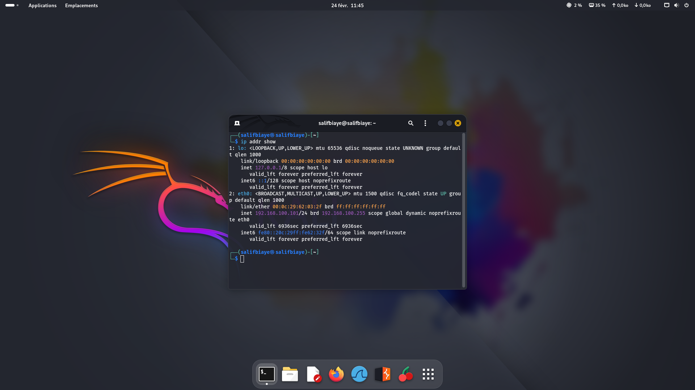

**Si pas d'IP configurée :**
```bash
sudo ip addr add 192.168.1.50/24 dev ens33
sudo ip route add default via 192.168.1.1
echo "nameserver 8.8.8.8" | sudo tee /etc/resolv.conf
```

### Tester la connectivité

```bash
ping -c 5 192.168.1.1    # Gateway pfSense
ping -c 5 192.168.1.100  # Serveur NSOC
ping -c 5 8.8.8.8        # Internet
```

**Ping vers pfSense réussi :**

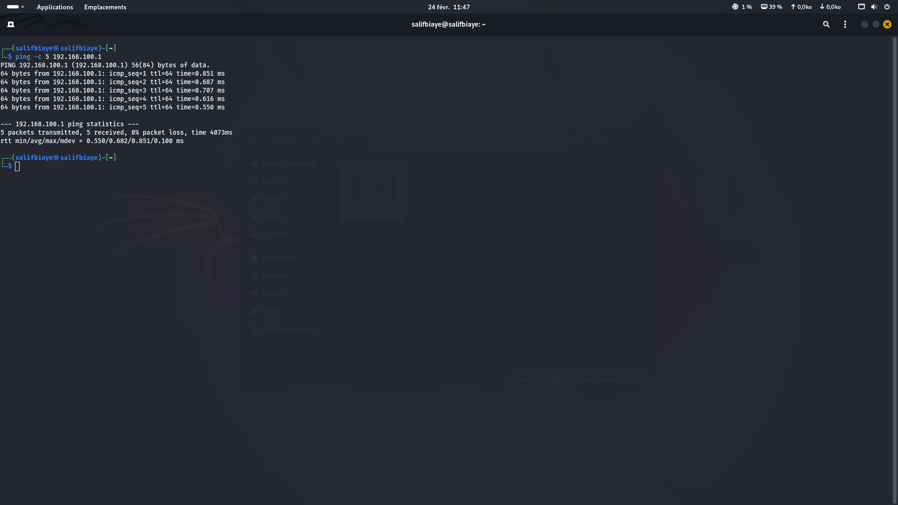

> ✅ **SUCCÈS :** Si les 3 pings fonctionnent, la configuration réseau est correcte.

### Accéder à l'enseigne NSOC

Depuis le navigateur du client, ouvrir : `http://192.168.1.100/enseigne.html`

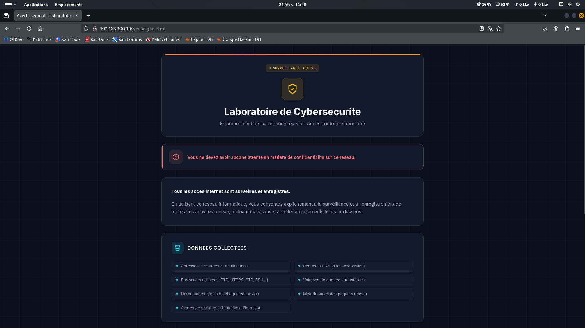

---

## 16.2 Génération de Trafic

### Trafic Web et DNS

```bash
# Requêtes HTTPS (génère des events TLS)
curl https://www.google.com
curl https://www.youtube.com
curl https://www.github.com

# Requêtes DNS
nslookup google.com
dig youtube.com A
dig facebook.com AAAA

# Boucle DNS multiple
for domain in google.com youtube.com facebook.com twitter.com; do
    nslookup $domain
    sleep 1
done
```

### Générer une alerte Suricata (IDS test)

```bash
# Déclencher une alerte IDS connue
curl http://testmyids.com
```

**Sortie attendue dans Kibana :** `event_type: "alert"` avec signature `GPL ATTACK_RESPONSE id check returned root`

### Capture d'écran génération de trafic

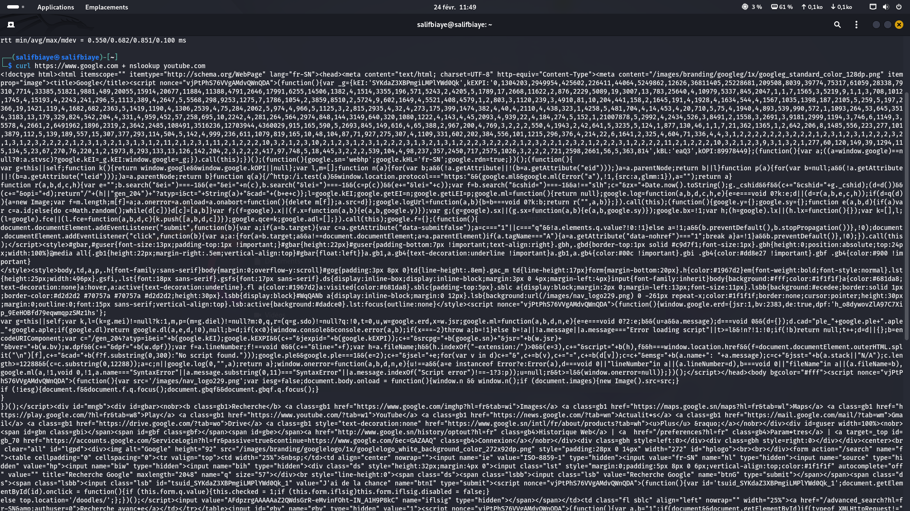

---

## 16.3 Vérification dans Kibana

### Rechercher les événements du client

**Dans Kibana Discover :**

```kql
src_ip: "192.168.1.50"
```

**Kibana — Events Suricata filtrés sur le client :**

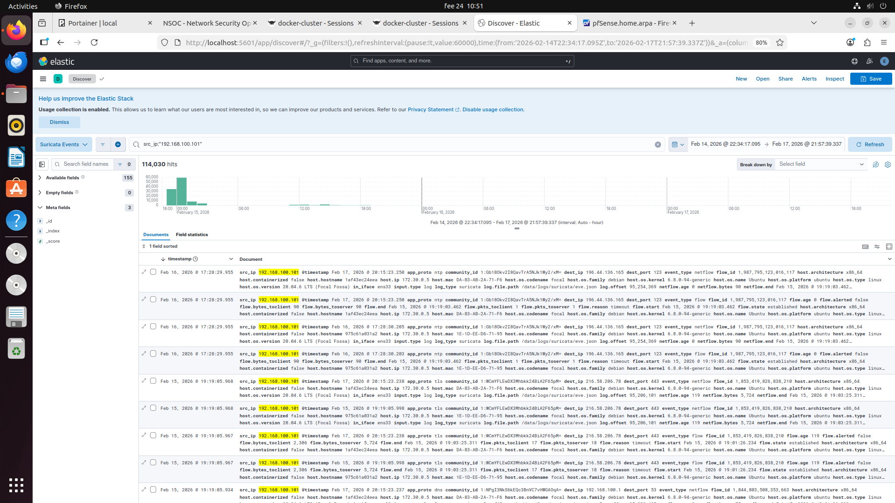

### Analyses complémentaires par index

*`suricata-*` — events IDS générés par le client :*
```kql
src_ip: "192.168.1.50" AND event_type: "dns"
src_ip: "192.168.1.50" AND event_type: "tls"
src_ip: "192.168.1.50" AND event_type: "alert"
```

*`arpwatch-*` — présence du client sur le réseau :*
```kql
ip: "192.168.1.50"
```
> La connexion du client génère automatiquement un event `new station` dans ARPWatch.

*`pfsense-*` — trafic du client vu par le firewall :*
```kql
src_ip: "192.168.1.50"
```
> Montre tout le trafic passant par pfSense depuis le client (autorisé et bloqué).

> ✅ **SUCCÈS :** Si des événements du client apparaissent dans Kibana, le pipeline complet fonctionne.

---

<div style="page-break-after: always;"></div>

# 🔍 PARTIE 4 : Validation et Maintenance

## 19. Checklist de Validation Complète

### Machine pfSense

- [ ] pfSense accessible via interface web (`https://192.168.1.1`)
- [ ] Interfaces WAN et LAN UP (Status → Interfaces)
- [ ] Port mirroring configuré et actif
- [ ] Routage fonctionnel (ping depuis client vers Internet)
- [ ] Table ARP visible (Diagnostics → ARP Table)
- [ ] Règles Firewall LAN configurées

### Machine Ubuntu NSOC — Containers

- [ ] `docker compose ps` → 12 containers (11 Up + kibana-init Exited 0)
- [ ] Elasticsearch répond : `curl http://localhost:9200/_cluster/health`
- [ ] Kibana accessible : `http://192.168.1.100:5601`
- [ ] Arkime v5 accessible : `http://192.168.1.100:8005` (login admin/admin)
- [ ] Portainer accessible : `http://192.168.1.100:9000`
- [ ] Page d'accueil Nginx : `http://192.168.1.100`
- [ ] Enseigne légale : `http://192.168.1.100/enseigne.html`
- [ ] Status API répond : `curl http://localhost:8888/health`

### Machine Ubuntu NSOC — Données

- [ ] Fichiers PCAP créés : `ls data/pcap/$(date +%Y-%m-%d)/`
- [ ] Logs Suricata présents : `wc -l data/logs/suricata/eve.json`
- [ ] `eve.json` grossit en temps réel : `tail -f data/logs/suricata/eve.json`
- [ ] Index Elasticsearch créés : `curl http://localhost:9200/_cat/indices?v`
- [ ] Index `suricata-*` présent avec documents (count > 0)
- [ ] Index `arpwatch-*` présent avec documents
- [ ] Index `pfsense-*` présent avec documents (syslog pfSense configuré)
- [ ] Data View `suricata-*` créé dans Kibana
- [ ] Data View `arpwatch-*` créé dans Kibana
- [ ] Data View `pfsense-*` créé dans Kibana
- [ ] Dashboards visibles dans Kibana (Analytics → Dashboards)
- [ ] Sessions PCAP visibles dans Arkime

### Machine Cliente

- [ ] Connectivité réseau OK (ping pfSense + NSOC + Internet)
- [ ] IP configurée dans `192.168.1.0/24`
- [ ] Enseigne NSOC visible depuis le client (`http://192.168.1.100/enseigne.html`)
- [ ] Trafic web généré (curl, nslookup)
- [ ] Événements du client visibles dans Kibana (`src_ip:"192.168.1.50"`)

---

## 20. Tests de Bout en Bout

### Scénario de test complet

```bash
# === MACHINE CLIENTE ===
ping -c 5 8.8.8.8
curl https://www.google.com
nslookup youtube.com
curl http://testmyids.com    # Déclenche une alerte Suricata

# === MACHINE UBUNTU NSOC (attendre 30 sec) ===
# Vérifier que le trafic du client est capturé
tail -f data/logs/suricata/eve.json | jq 'select(.src_ip=="192.168.1.50")'

# === KIBANA (http://192.168.1.100:5601) ===
# Rechercher: src_ip:"192.168.1.50"
# Doit afficher tous les événements générés par le client
```

> ✅ **SUCCÈS :** Si les événements du client apparaissent dans Kibana, le pipeline Client → pfSense → NSOC → Kibana est opérationnel.

---

## 21. Dépannage

### 21.1 pfSense — Pas de trafic capturé

```bash
# Sur Ubuntu NSOC — tester la capture manuelle
sudo tcpdump -i ens33 -c 50

# Si aucun paquet → problème de port mirroring
# Vérifier le câblage et la config du switch
```

### 21.2 Elasticsearch ne démarre pas

**Erreur :** `max virtual memory areas vm.max_map_count is too low`

```bash
sudo sysctl -w vm.max_map_count=262144
echo "vm.max_map_count=262144" | sudo tee -a /etc/sysctl.conf
docker compose restart elasticsearch
```

### 21.3 Filebeat — "config file must be owned by root"

```bash
sudo chown root:root configs/filebeat/filebeat.yml
sudo chmod 644 configs/filebeat/filebeat.yml
docker compose rm -f filebeat
docker compose up -d filebeat
```

### 21.4 Kibana — "Server is not ready yet"

```bash
# Vérifier ES d'abord
curl -u elastic:changeme http://localhost:9200/_cluster/health?pretty

# Attendre 3 min puis vérifier Kibana
docker compose logs kibana | tail -50
docker compose restart kibana
```

### 21.5 Arkime — Pas de sessions

```bash
# Vérifier les logs Arkime Capture
docker compose logs arkime-capture | tail -50

# Vérifier que des paquets arrivent sur l'interface
sudo tcpdump -i ens33 -c 20

# Redémarrer Arkime
docker compose restart arkime-capture arkime
```

### 21.6 Manque de mémoire

```bash
free -h
docker stats

# Réduire la RAM d'Elasticsearch
nano .env
# ES_MEMORY=2g → ES_MEMORY=1g
docker compose restart elasticsearch
```

### 21.7 Permissions volumes

```bash
sudo chown -R 1000:1000 data/elasticsearch
sudo chmod -R 755 data/logs data/pcap data/arkime
```

---

## 22. Commandes de Référence

### Gestion Docker Compose

```bash
# Démarrer
docker compose up -d

# Arrêter
docker compose down

# Redémarrer un service
docker compose restart suricata
docker compose restart kibana
docker compose restart arkime

# Logs en temps réel
docker compose logs -f suricata
docker compose logs -f arkime
docker compose logs --tail 50 elasticsearch

# État des containers
docker compose ps
docker stats
```

### Vérification des données

```bash
# Logs Suricata en temps réel
tail -f data/logs/suricata/eve.json | jq '.'

# Filtrer par type
tail -f data/logs/suricata/eve.json | jq 'select(.event_type=="alert")'
tail -f data/logs/suricata/eve.json | jq 'select(.event_type=="dns")'
tail -f data/logs/suricata/eve.json | jq 'select(.src_ip=="192.168.1.50")'

# Compter les événements
wc -l data/logs/suricata/eve.json

# Fichiers PCAP
ls -lh data/pcap/$(date +%Y-%m-%d)/
```

### Vérification Elasticsearch

```bash
# Avec authentification
curl -u elastic:changeme http://localhost:9200/_cluster/health?pretty
curl -u elastic:changeme http://localhost:9200/_cat/indices?v
curl -u elastic:changeme "http://localhost:9200/suricata-*/_count" | jq '.'
```

### Vérification Arkime

```bash
# Test API Arkime
curl -u admin:admin http://localhost:8005/api/sessions | jq '.'

# Vérifier les stats
curl -u admin:admin http://localhost:8005/api/stats | jq '.'
```

### URLs de référence

| Service | URL | Credentials |
|---------|-----|-------------|
| **Page d'accueil NSOC** | `http://192.168.1.100` | — |
| **Enseigne légale** | `http://192.168.1.100/enseigne.html` | — |
| **Kibana** | `http://192.168.1.100:5601` | elastic / changeme |
| **Arkime v5** | `http://192.168.1.100:8005` | admin / admin |
| **Portainer** | `http://192.168.1.100:9000` | À définir |
| **Status API** | `http://192.168.1.100:8888/health` | — |
| **Elasticsearch** | `http://192.168.1.100:9200` | elastic / changeme |
| **pfSense** | `https://192.168.1.1` | admin / pfsense |

---

<div style="page-break-after: always;"></div>

# 🎬 PARTIE 5 : Démonstrations Vidéo

## 23. Liens Vidéo

> ⚠️ **ATTENTION :** Remplacer les `[LIEN_VIDEO_X]` par les URLs Google Drive / YouTube après upload. Consulter `SCREENSHOTS-CHECKLIST.md` pour les instructions d'enregistrement.

| # | Vidéo | Description | Lien |
|---|-------|-------------|------|
| **V1** | Démarrage `docker compose up -d` | Stack qui démarre, 12 containers UP | [▶️ Regarder][LIEN_VIDEO_1] |
| **V2** | Client → pfSense → enseigne NSOC | Client se connecte, voit l'enseigne | [▶️ Regarder][LIEN_VIDEO_2] |
| **V3** | Kibana — 3 types d'events en temps réel | Navigation dns/tls/alert + filtrage KQL | [▶️ Regarder][LIEN_VIDEO_3] |
| **V4** | Arkime — analyse PCAP | Sessions, inspection paquet, filtres | [▶️ Regarder][LIEN_VIDEO_4] |
| **V5** | Alerte Suricata en direct | `curl testmyids.com` → alerte Kibana | [▶️ Regarder][LIEN_VIDEO_5] |
| **V6** | Dashboard Kibana avec trafic client | Trafic client → logs en temps réel | [▶️ Regarder][LIEN_VIDEO_6] |

> 💡 **INFO :** Recommandation — Regardez V1 (démarrage) puis V5 (alerte en direct) pour comprendre le pipeline complet.

---

<div style="page-break-after: always;"></div>

# 🎯 24. Conclusion

<div align="center">

### ✨ Installation Complète — 3 Machines, 12 Services ✨

</div>

**🎓 Félicitations !** Votre plateforme de surveillance réseau NSOC est opérationnelle avec une architecture professionnelle à 3 machines et 12 services Docker.

### Ce que vous avez accompli

| ✅ Étape | 📝 Réalisation |
|----------|----------------|
| **1. pfSense** | Routeur configuré avec port mirroring SPAN actif |
| **2. Suricata 7.0** | IDS déployé, 64k règles, génère eve.json |
| **3. Arkime v5** | Analyseur PCAP interactif opérationnel (:8005) |
| **4. ELK 8.11.0** | Elasticsearch + Kibana avec dashboards configurés |
| **5. Portainer** | Interface Docker web opérationnelle (:9000) |
| **6. Status API** | API santé services opérationnelle (:8888) |
| **7. Enseigne légale** | Page de conformité accessible (/enseigne.html) |
| **8. Client Linux** | Machine de test générant du trafic capturé |

### Architecture opérationnelle

```
Client Linux → Trafic réseau → pfSense (SPAN) → Ubuntu NSOC
                                                    ↓
                                              Suricata → eve.json → Filebeat → Elasticsearch → Kibana
                                              Arkime Capture → PCAP sessions → Arkime Viewer
```

### Prochaines étapes recommandées

1. **📊 Personnaliser les dashboards Kibana** — Créer des visualisations spécifiques à votre réseau
2. **🔍 Explorer Arkime** — Analyser les sessions PCAP en détail
3. **⚙️ Ajouter des règles Suricata** — Créer des règles de détection personnalisées
4. **📈 Configurer des alertes** — Watcher Kibana pour les événements critiques
5. **🔒 Changer les mots de passe** — elastic/changeme → mots de passe forts

### Bonnes pratiques

- **🔒 Sécurité :** Changer tous les mots de passe par défaut
- **💾 Backup :** `tar -czf backup-configs-$(date +%F).tar.gz configs/ .env docker-compose.yml`
- **🧹 Nettoyage :** `find data/pcap/ -type f -mtime +7 -delete` (hebdomadaire)
- **📊 Monitoring :** Vérifier quotidiennement `df -h` et `free -h`
- **🔄 Mise à jour :** `docker compose pull && docker compose up -d` (mensuel)

---

**📄 Métadonnées du Document**

| Champ | Valeur |
|-------|--------|
| **Document** | Guide d'Installation Privé — NSOC |
| **Classification** | 🔒 Confidentiel — Usage Interne |
| **Version** | 3.0 — Stack 12 services + Arkime v5 |
| **Date** | Février 2026 |
| **Auteurs** | Salif Biaye, Ndeye Astou Diagouraga |
| **Institution** | ESP — UCAD, Dakar |
| **Formation** | DIC-3-GLSI — Génie Informatique |
| **Projet** | Network Security Operations Center |

---

<div align="center">

**🔒 Document Confidentiel — Ne Pas Diffuser**

**Made with ❤️ for Cybersecurity Education**

🛡️ **NSOC** — Protecting Networks, One Packet at a Time

</div>
