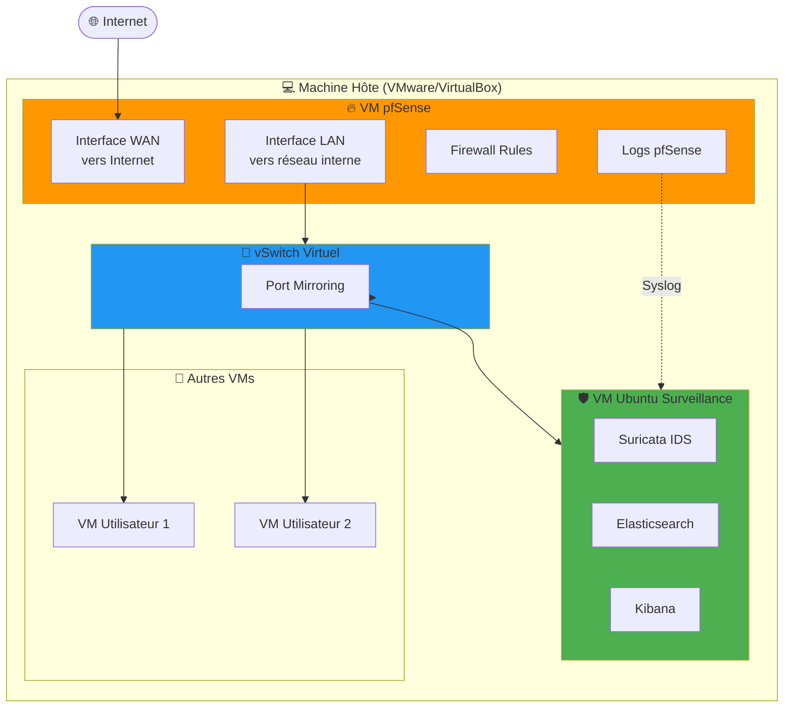

# 🔥 Guide Complet: pfSense + Surveillance Réseau

**Objectif:** Ajouter pfSense comme firewall et l'intégrer avec ton système de surveillance

---

## 📋 Vue d'ensemble

### Avant (ce que tu as):
```
Internet → Routeur → Switch → VMs/Utilisateurs
                        ↓
                   VM Ubuntu (Surveillance)
                   Écoute en mode miroir
```

### Après (avec pfSense):
```
Internet → [VM pfSense] → Switch Virtuel → VMs/Utilisateurs
           Firewall           ↓
                         VM Ubuntu (Surveillance)
                         Écoute tout le trafic

pfSense envoie aussi ses logs → Elasticsearch
```

---

## 🎯 Architecture Cible



---

## 📦 Prérequis

### Ce qu'il te faut:

1. **Hyperviseur installé:**
   - VMware Workstation/Player
   - VirtualBox
   - Proxmox
   - ESXi

2. **Ressources minimales pour pfSense:**
   - CPU: 1 core (2 recommandé)
   - RAM: 1 GB (2 GB recommandé)
   - Disque: 8 GB minimum
   - **2 interfaces réseau virtuelles** (important!)

3. **Ta VM Ubuntu surveillance:**
   - Déjà configurée et fonctionnelle ✅

---

## 🚀 ÉTAPE 1: Télécharger pfSense

### 1.1 Téléchargement

```
1. Aller sur: https://www.pfsense.org/download/

2. Sélectionner:
   Architecture: AMD64 (64-bit)
   Installer: DVD Image (ISO)
   Mirror: Choisir le plus proche (Europe, US, etc.)

3. Télécharger le fichier:
   pfSense-CE-2.7.2-RELEASE-amd64.iso.gz
   (environ 400 MB)

4. Décompresser:
   gunzip pfSense-CE-2.7.2-RELEASE-amd64.iso.gz

   Résultat: pfSense-CE-2.7.2-RELEASE-amd64.iso
```

---

## 🖥️ ÉTAPE 2: Créer la VM pfSense

### 2.1 Configuration VM (VMware Workstation exemple)

```
1. Nouvelle VM:
   - File → New Virtual Machine
   - Custom (advanced)

2. Compatibility: Workstation 17.x (ou ta version)

3. Install from:
   - Installer disc image file (iso)
   - Sélectionner: pfSense-CE-2.7.2-RELEASE-amd64.iso

4. Guest OS:
   - FreeBSD 13 64-bit (ou plus récent)

5. VM Name:
   - Name: pfSense-Firewall
   - Location: [ton dossier VMs]

6. Processors:
   - 1 processor, 2 cores
   (ou 2 processors, 1 core chacun)

7. Memory:
   - 2048 MB (2 GB)

8. Network (IMPORTANT!):
   - Adapter 1: Bridged (WAN - vers Internet)
   - Adapter 2: VMnet2 (LAN - réseau interne)

   ⚠️ Tu vas ajouter le 2ème après création

9. I/O Controller: LSI Logic (recommandé)

10. Virtual Disk:
    - Create a new virtual disk
    - 8 GB minimum (20 GB recommandé)
    - Store as single file

11. Finish
```

### 2.2 Ajouter la 2ème interface réseau

```
1. VM Settings → Add → Network Adapter

2. Type: Custom (VMnet2)
   - VMnet2 sera ton réseau LAN interne
   - Toutes tes VMs (surveillance + utilisateurs) seront sur VMnet2

3. OK
```

### 2.3 Vérification avant démarrage

```
Network Adapters:
✅ Network Adapter 1: Bridged (WAN)
✅ Network Adapter 2: VMnet2 (LAN)
```

---

## ⚙️ ÉTAPE 3: Installer pfSense

### 3.1 Premier démarrage

```
1. Power On la VM

2. Attendre le boot (30 secondes)

3. Tu verras:
   ***********************************************
   *  Welcome to pfSense                        *
   ***********************************************

   Should VLANs be set up now [y|n]?
   → Taper: n (pas de VLANs pour l'instant)
   ENTER
```

### 3.2 Configuration des interfaces

```
1. Enter the WAN interface name:
   → Taper: em0 (ou vmx0 selon ton hyperviseur)
   ENTER

   ℹ️ Comment savoir?
   - em0 = première interface réseau
   - em1 = deuxième interface
   - Si pas sûr, tape: em0

2. Enter the LAN interface name:
   → Taper: em1
   ENTER

3. Enter the Optional 1 interface name:
   → Laisser vide
   ENTER

4. Confirmation:
   Do you want to proceed [y|n]?
   → Taper: y
   ENTER
```

### 3.3 Installation sur disque

```
1. Tu vois le menu pfSense. Taper: 0 (zero)
   → Logout (oui, c'est bizarre mais normal)

2. Login: installer (tout en minuscules)
   Password: pfsense

3. Install pfSense:
   - Accept (ENTER)
   - Continue with default keymap (ENTER)
   - Auto (ZFS) - Proceed with Installation (ENTER)
   - Install - Proceed with Installation (ENTER)
   - Stripe - No Redundancy (ENTER)
   - Spacebar pour sélectionner le disque
   - ENTER
   - YES (confirmer destruction données)
   - Attendre l'installation (2-3 minutes)

4. Quand c'est fini:
   → Reboot (ENTER)

5. IMPORTANT: Retirer l'ISO
   VM Settings → CD/DVD → Use physical drive
   (ou décocher "Connect at power on")
```

---

## 🔧 ÉTAPE 4: Configuration initiale pfSense

### 4.1 Premier boot post-installation

```
1. La VM redémarre

2. Attendre le menu principal (1 minute):

***********************************************
pfSense - Netgate Device ID: xxxxx

WAN (em0)     -> v4: 192.168.1.XXX/24
                 v6: [...]
LAN (em1)     -> v4: 192.168.1.1/24

0) Logout                         7) Ping host
1) Assign interfaces              8) Shell
2) Set interface(s) IP address    9) pfTop
3) Reset webConfigurator password 10) Filter logs
4) Reset to factory defaults      11) Restart webConfigurator
5) Reboot system                  12) PHP shell + pfSense tools
6) Halt system                    13) Update from console
***********************************************

Enter an option:
```

### 4.2 Configurer l'IP LAN

```
1. Taper: 2 (Set interface IP address)
   ENTER

2. Available interfaces:
   1 - WAN (em0)
   2 - LAN (em1)

   Enter the number: 2
   ENTER

3. Configure IPv4 address LAN interface via DHCP? [y/n]
   → n
   ENTER

4. Enter the new LAN IPv4 address:
   → 192.168.100.1
   ENTER

   ℹ️ Tu choisis ce réseau (192.168.100.x)
   C'est ton réseau LAN interne pour toutes tes VMs

5. Enter the new LAN IPv4 subnet bit count:
   → 24
   ENTER

6. For a WAN, press ENTER:
   → (juste ENTER, pas de gateway pour LAN)

7. Configure IPv6 LAN via DHCP6? [y/n]
   → n
   ENTER

8. Enter the new LAN IPv6 address:
   → (juste ENTER, on skip IPv6 pour l'instant)

9. Enable DHCP server on LAN? [y/n]
   → y (oui, pour donner des IPs aux VMs)
   ENTER

10. Enter the start address:
    → 192.168.100.100
    ENTER

11. Enter the end address:
    → 192.168.100.200
    ENTER

12. Revert to HTTP as webConfigurator protocol? [y/n]
    → n (on garde HTTPS)
    ENTER
```

### 4.3 Résultat attendu

```
LAN (em1)     -> v4: 192.168.100.1/24

The IPv4 LAN address has been set to 192.168.100.1/24
You can now access the webConfigurator at:
https://192.168.100.1/

Press ENTER to continue.
```

---

## 🌐 ÉTAPE 5: Configurer ta VM Ubuntu

### 5.1 Changer l'interface réseau de la VM Ubuntu

```
1. Éteindre ta VM Ubuntu:
   sudo shutdown -h now

2. VM Settings → Network Adapter:
   - Avant: Bridged
   - Après: Custom (VMnet2) ← Même réseau que pfSense LAN!

3. Démarrer la VM Ubuntu
```

### 5.2 Configurer l'IP de la VM Ubuntu

```
1. SSH ou console dans ta VM Ubuntu

2. Vérifier l'interface:
   ip link show

   Exemple de sortie:
   1: lo: ...
   2: ens33: ... (ton interface réseau)

3. Configurer en IP statique:
   sudo nano /etc/netplan/00-installer-config.yaml
```

**Contenu:**
```yaml
network:
  version: 2
  ethernets:
    ens33:  # Ton interface (peut être ens33, eth0, etc.)
      addresses:
        - 192.168.100.10/24  # IP dans le réseau pfSense LAN
      routes:
        - to: default
          via: 192.168.100.1  # Gateway = pfSense LAN
      nameservers:
        addresses:
          - 192.168.100.1     # DNS = pfSense
          - 8.8.8.8
```

**Appliquer:**
```bash
sudo netplan apply

# Vérifier
ip addr show ens33
# Doit afficher: 192.168.100.10/24

# Tester la connexion à pfSense
ping 192.168.100.1
# Doit répondre!

# Tester Internet
ping 8.8.8.8
# Doit répondre aussi!
```

---

## 🎛️ ÉTAPE 6: Configuration Web pfSense

### 6.1 Accéder à l'interface Web

```
1. Depuis ta VM Ubuntu (ou depuis ton hôte sur VMnet2):
   firefox https://192.168.100.1

   ⚠️ Certificat SSL non fiable → Accepter le risque

2. Login par défaut:
   Username: admin
   Password: pfsense

3. Premier wizard de configuration:
   → Next → Next (accepter les defaults pour l'instant)

4. General Information:
   - Hostname: pfsense
   - Domain: localdomain
   - Primary DNS: 8.8.8.8
   - Secondary DNS: 8.8.4.4
   → Next

5. Time Server:
   - Timezone: Africa/Dakar (ou ta timezone)
   → Next

6. WAN Configuration:
   - Type: DHCP (si ton routeur donne une IP)
   - Ou Static si tu veux configurer manuellement
   → Next

7. LAN Configuration:
   - LAN IP: 192.168.100.1 (déjà configuré)
   - Subnet Mask: 24
   → Next

8. Admin Password:
   - Changer le password par défaut!
   - Admin Password: [ton-mot-de-passe-fort]
   - Confirm: [même]
   → Next

9. Reload Configuration:
   → Reload

10. Finish:
    → Tu es maintenant sur le Dashboard pfSense!
```

---

## 🔐 ÉTAPE 7: Règles de Firewall de Base

### 7.1 Autoriser le trafic LAN

```
1. Firewall → Rules → LAN

2. Par défaut, pfSense a une règle "Default allow LAN to any"
   → Ça devrait déjà fonctionner!

3. Si pas de règle, Add:
   - Action: Pass
   - Interface: LAN
   - Protocol: Any
   - Source: LAN net
   - Destination: Any
   → Save → Apply Changes
```

### 7.2 Vérifier que ça marche

```
Depuis ta VM Ubuntu:
ping google.com
curl https://google.com

→ Doit fonctionner!
```

---

## 📊 ÉTAPE 8: Envoyer les logs pfSense → Elasticsearch

### 8.1 Configurer Syslog sur pfSense

```
1. Status → System Logs → Settings (onglet)

2. General Logging Options:
   - Log Message Format: syslog (RFC 5424)

3. Remote Logging Options:
   ✅ Enable Remote Logging

   Remote log servers:
   - Server 1: 192.168.100.10:5140
     (IP de ta VM Ubuntu : port syslog)

   Remote Syslog Contents:
   ✅ Firewall Events
   ✅ DHCP Events
   ✅ System Events
   ✅ VPN Events (si tu utilises)

4. Save
```

### 8.2 Configurer Filebeat pour recevoir Syslog

**Sur ta VM Ubuntu:**

```bash
cd /opt/surveillance-reseau
nano configs/filebeat/filebeat.yml
```

**Ajouter cet input:**
```yaml
# ============================================
# Logs pfSense (Syslog)
# ============================================
  - type: syslog
    enabled: true
    protocol.udp:
      host: "0.0.0.0:5140"
    fields:
      log_type: pfsense
    fields_under_root: true
```

**Mettre à jour les outputs:**
```yaml
output.elasticsearch:
  hosts: ["elasticsearch:9200"]
  indices:
    - index: "suricata-%{+yyyy.MM.dd}"
      when.equals:
        log_type: "suricata"
    - index: "arpwatch-%{+yyyy.MM.dd}"
      when.equals:
        log_type: "arpwatch"
    - index: "pfsense-%{+yyyy.MM.dd}"
      when.equals:
        log_type: "pfsense"
    - index: "logs-%{+yyyy.MM.dd}"
```

**Redémarrer Filebeat:**
```bash
docker compose restart filebeat
```

### 8.3 Créer un Data View pfSense dans Kibana

**Ajouter dans `scripts/init-kibana.sh`:**
```bash
# Créer Data View pfSense
echo "[INIT] Création du Data View pfSense..."
curl -X POST "http://kibana:5601/api/data_views/data_view" \
  -H "kbn-xsrf: true" \
  -H "Content-Type: application/json" \
  -d '{
    "data_view": {
      "title": "pfsense-*",
      "name": "pfSense Firewall Logs",
      "timeFieldName": "@timestamp"
    }
  }' 2>&1 | head -5
```

**Ou le faire manuellement dans Kibana:**
```
Stack Management → Data Views → Create
- Name: pfSense Firewall Logs
- Index pattern: pfsense-*
- Timestamp: @timestamp
→ Save
```

---

## 🔍 ÉTAPE 9: Vérifier l'intégration

### 9.1 Générer du trafic

```bash
# Depuis ta VM Ubuntu
ping google.com
curl https://youtube.com
curl https://facebook.com
```

### 9.2 Vérifier dans pfSense

```
1. Firewall → Log Files → Firewall

2. Tu dois voir les connexions:
   - Pass (autorisé)
   - Source: 192.168.100.10 (ta VM)
   - Destination: IPs externes
```

### 9.3 Vérifier dans Elasticsearch

```bash
# Vérifier l'index pfSense
curl -s http://localhost:9200/pfsense-*/_count | jq

# Voir un exemple de log
curl -s http://localhost:9200/pfsense-*/_search?size=1 | jq
```

### 9.4 Vérifier dans Kibana

```
1. Discover → Sélectionner "pfSense Firewall Logs"

2. Tu devrais voir les événements:
   - Action (pass/block)
   - Source IP
   - Destination IP
   - Ports
   - Protocol
```

---

## 🎯 ÉTAPE 10: Dashboard Unifié Kibana

### 10.1 Créer un Dashboard "Vue Complète Réseau"

```
1. Analytics → Dashboard → Create

2. Add from library:
   - Total Événements Suricata
   - Total Événements pfSense (créer nouveau Metric)
   - Top 10 Sites Visités
   - Timeline pfSense (bloquer vs autorisé)
   - Top IPs bloquées par pfSense

3. Arranger joliment

4. Save as "Vue Complète Réseau - pfSense + Suricata"
```

---

## 📐 Architecture Finale

```
┌─────────────────────────────────────────────────┐
│          💻 Machine Hôte                        │
│                                                 │
│  ┌──────────────┐          ┌─────────────────┐ │
│  │ VM pfSense   │          │ VM Ubuntu       │ │
│  │              │          │ Surveillance    │ │
│  │ WAN: Bridged │◄────────►│ ens33: VMnet2   │ │
│  │ LAN: VMnet2  │  Logs    │                 │ │
│  │              │  Syslog  │ Suricata        │ │
│  │ 192.168.100.1│          │ Elasticsearch   │ │
│  └──────┬───────┘          │ Kibana          │ │
│         │                  │ 192.168.100.10  │ │
│         │                  └─────────────────┘ │
│         │                                      │
│    ┌────▼─────┐                                │
│    │ vSwitch  │                                │
│    │ (VMnet2) │                                │
│    │          │                                │
│    │ Mirror   │                                │
│    └────┬─────┘                                │
│         │                                      │
│    ┌────▼────────┐                             │
│    │ Autres VMs  │                             │
│    │ Utilisateurs│                             │
│    └─────────────┘                             │
└─────────────────────────────────────────────────┘
         ▲
         │
    🌐 Internet
```

---

## ✅ Checklist Finale

- [ ] pfSense VM créée avec 2 interfaces
- [ ] pfSense installé et configuré (192.168.100.1)
- [ ] VM Ubuntu sur VMnet2 (192.168.100.10)
- [ ] Internet fonctionne depuis Ubuntu via pfSense
- [ ] Logs pfSense → Filebeat configuré
- [ ] Index pfSense dans Elasticsearch
- [ ] Data View pfSense dans Kibana
- [ ] Dashboard unifié créé
- [ ] Port mirroring configuré (optionnel)

---

## 🎊 Résultat Final

Tu as maintenant:

1. ✅ **pfSense** = Firewall actif, bloque les menaces
2. ✅ **Suricata** = IDS, surveille tout le trafic
3. ✅ **ARPWatch** = Détection ARP spoofing
4. ✅ **Elasticsearch** = Stocke TOUS les logs (pfSense + Suricata + ARP)
5. ✅ **Kibana** = Vue unifiée de TOUT

**Protection double:**
- pfSense bloque en temps réel
- Suricata analyse et alerte

**Visibilité complète:**
- Qui a été bloqué? (pfSense)
- Qui passe et fait quoi? (Suricata)
- Changements réseau suspects? (ARPWatch)

🚀 **Système de surveillance réseau professionnel complet!**

---

**Besoin d'aide?**
- pfSense doc: https://docs.netgate.com/pfsense/
- Discord pfSense: https://discord.gg/pfsense
